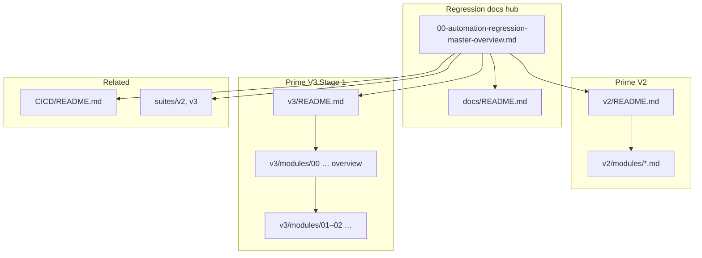

# Automation Regression Suite – Master Overview (Markdown companion)

This page is the **documentation hub** for the nightly automation regression program. It mirrors the intent of the Confluence **Automation Regression Suite – Master Overview** export and lists every **current** Markdown page under `docs/`.

---

## Canonical PDF (parent export)

| Resource | Path (from repo root) |
|----------|------------------------|
| **Master Overview PDF** | [`../reports/Automation Regression Suite – Master Overview.pdf`](../reports/Automation Regression Suite – Master Overview.pdf) |

Use the PDF for the official visual/layout copy; use this file and the links below for **up-to-date** structure, suite paths, and Confluence-ready Markdown.

**TestNG HTML exports (cleanup & naming):** [GUIDE_TESTNG_REPORT_EXPORT_AND_CLEANUP.md](GUIDE_TESTNG_REPORT_EXPORT_AND_CLEANUP.md)

---

## Documentation map (navigation)

*Update this diagram when adding V2/V3 module pages or new top-level doc areas — or run prompt **J)** in `00_SYSTEM/PROMPTS.md`.*

---

## 1. Prime V2 – Nightly regression (Stage 1)

**Entry point:** [v2/README.md](v2/README.md)

### 1.0 Overview & program docs

| # | Document | Purpose |
|---|----------|---------|
| 0 | [00-v2-regression-overview.md](v2/00-v2-regression-overview.md) | Purpose, environment, schedule, module summary |
| 1 | [01-v2-module-coverage.md](v2/01-v2-module-coverage.md) | Per-module coverage, tags, counts |
| 2 | [02-v2-suite-and-job-details.md](v2/02-v2-suite-and-job-details.md) | TestNG XML, Jenkins, smoke/release/weekly |
| 3 | [03-v2-documentation-delta.md](v2/03-v2-documentation-delta.md) | Changes vs legacy Confluence PDFs |

### 1.1–1.14 Per-module Confluence pages

| # | Page | Module |
|---|------|--------|
| 01 | [01-enrollment.md](v2/modules/01-enrollment.md) | Enrollment |
| 02 | [02-legacy-web-registration.md](v2/modules/02-legacy-web-registration.md) | Legacy Web Registration |
| 03 | [03-legacy-web-login.md](v2/modules/03-legacy-web-login.md) | Legacy Web Login |
| 04 | [04-csr-account-maintenance.md](v2/modules/04-csr-account-maintenance.md) | CSR Account Maintenance |
| 05 | [05-contributions.md](v2/modules/05-contributions.md) | Contributions |
| 06 | [06-withdrawals.md](v2/modules/06-withdrawals.md) | Withdrawals |
| 07 | [07-account-balance-page.md](v2/modules/07-account-balance-page.md) | Account Balance Page |
| 08 | [08-sardine-regression.md](v2/modules/08-sardine-regression.md) | Sardine Regression |
| 09 | [09-investment-options.md](v2/modules/09-investment-options.md) | Investment Options |
| 10 | [10-empower-plan.md](v2/modules/10-empower-plan.md) | Empower Plan |
| 11 | [11-smoke-suites.md](v2/modules/11-smoke-suites.md) | Smoke suites |
| 12 | [12-release-suites.md](v2/modules/12-release-suites.md) | Release gate suites |
| 13 | [13-weekly-backoffice.md](v2/modules/13-weekly-backoffice.md) | Weekly backoffice |
| 14 | [14-other-specialty.md](v2/modules/14-other-specialty.md) | Other / specialty |

**Suite XML mirror:** `AM_Regression_Reports/suites/v2/` (daily, smoke, release, weekly, other, archive).

---

## 2. Prime V3 – Stage 1 front office (UE + IDP)

**Entry point:** [v3/README.md](v3/README.md)

### 2.0 Parent & child pages (current)

| Role | Document |
|------|----------|
| **Parent** (combined overview, pipeline, metrics) | [00-stage1-v3-combined-overview.md](v3/modules/00-stage1-v3-combined-overview.md) |
| **Child** – IDP Login | [01-idp-login-stage1.md](v3/modules/01-idp-login-stage1.md) |
| **Child** – Universal Enrollment | [02-universal-enrollment-stage1.md](v3/modules/02-universal-enrollment-stage1.md) |

**Module index:** [v3/modules/README.md](v3/modules/README.md)

**Suite XML mirror:** `AM_Regression_Reports/suites/v3/` — `stage1-regression-master.xml`, `universal-enrollment-stage1.xml`, `idp-login-stage1.xml`.

**HTML reports (local):** `AM_Regression_Reports/reports/v3/` — see [reports/v3/README.md](../reports/v3/README.md) and [GUIDE_TESTNG_REPORT_EXPORT_AND_CLEANUP.md](GUIDE_TESTNG_REPORT_EXPORT_AND_CLEANUP.md) (export cleanup / naming).

### Legacy Confluence PDFs (reference only)

| Topic | Location |
|-------|----------|
| V3 overview | `10_IMPORTS_RAW/confluence_exports/auto-qa-dochub/regression-master-overview/2. Unite  Prime V3 Regression Suite – Overview.pdf` |
| UE coverage | `…/2.1. Universal Enrollment Regression Coverage – Prime V3.pdf` |

---

## 3. Repo layout (quick reference)

| Folder | Purpose |
|--------|---------|
| `docs/` | **Check in** — this master page + V2/V3 Markdown |
| `suites/` | **Check in** — TestNG XML mirrors |
| `reports/` | Usually **gitignored** — raw HTML/PDF exports (regenerable from CI) |

---

## 4. Related KB items

| Item | Path |
|------|------|
| Bug reporting | `10_IMPORTS_RAW/regression_reports/BUG_REPORTING_PROCESS.md` |
| Folder index | [AM_Regression_Reports/README.md](../README.md) |

---

*Last aligned with docs structure: 2026-02 — V2 modules 01–14; V3 Stage 1 parent `00` + children `01`–`02`.*
