# QA Automation & Performance Engineering – Leadership Working Update (As of 03/04/2026)

**Document:** MAIN – Persistent Updates (As of 03-04-2026)  
**Section:** 5. Automation Team – Detailed Working Update  
**Period Covered:** Feb 19, 2026 – Mar 4, 2026  
**Purpose:** Detailed working update since last leadership share-out (Feb 18)  
**Owner:** QA Automation Team

---

## QA Automation Team – Velocity & Key Metrics (As of 03/04/2026)

*QA Automation reports in **test cases added, coverage expansion, bugs found, and pipeline milestones** (not story points).*

### Team Structure & Focus

| Name | Role | Primary Focus | Key Contribution (This Period) |
|------|------|----------------|--------------------------------------|
| **Swapnil Patil** | Project Lead | Program delivery, intake, leadership alignment | Overall program execution; pipeline strategy; cross-team alignment; CAT smoke & Empower coordination. |
| **Sunil Godiyal** | Tech Lead (Offshore), Sr SDET | API Automation | API pipeline implemented via GitHub Actions; API test suite stable; next focus: CAT/Stage 5 API suite. |
| **Priti Choudhary** | Performance Test Engineer | Perf testing (IDP login, auth, enroll, txn) | IDP Login e2e perf tests added to Jenkins; Forgot Username/Password perf tests WIP; enrollment/metadata/accounts suites stable and ready for scheduled jobs; expanding coverage with Sri Mounica & Abhitosh. |
| **Venkatesh Mallela** | Sr SDET | Prime V2 automation | V2 expanded to **454 nightly TCs**; new coverage for Transfer, Exchange, Fund Allocation, Investment Portfolio (Member + CSR); SME-driven gap closure; flakiness minimal. Monthly Unite release support, nightly regression & bug docs. |
| **Dinesh Kumar** | Sr SDET | Prime V3 regression | V3 expanded to **325+ TCs** (IDP 33 + UE 265 + CSR 30); CSR Personal Information added; 30+ TCs to be added soon. Monthly Unite release support, nightly regression & bug docs. |

### Key Summary

- **V2:** Regression at **454 nightly TCs** (up from 381+). New coverage: Transfer, Exchange, Fund Allocation, Investment Portfolio for Member and CSR flows. SME collaboration, gap closure, flakiness minimal. Offshore monitors nightly.
- **V3:** Regression at **325+ TCs** (IDP 33 + UE 265 + Unite CSR 30; up from ~255+). CSR Personal Information added; validated and executing nightly. 30+ additional TCs coming soon.
- **API:** Pipeline milestone — API automation pipeline implemented via **GitHub Actions** (pipeline config, CI workflow, initial validation). UI pipeline prototype (~13 Unite V3 CSR tests). QC4 → API, Stage1 → UI. Deployed with Dong. CAT/Stage 5 API suite next.
- **Performance:** IDP Login e2e added to Jenkins; pipeline scheduling this week. Forgot Username/Password WIP. Enrollment, Metadata, Accounts suites stable — ready for scheduled nightly jobs.
- **CAT/Stage 5:** Smoke test suite created for partner environment quick-validation (V2 CSR + V3 IDP/UE). Separate from main regression.
- **Cross-team:** Empower/Whitecap test cases added (Promod); integrated into nightly; some failures under investigation.
- **Total regression coverage:** **779+ TCs** nightly (V2 454 + V3 325+).

### Key Metrics (QA Automation)

| Metric | Value | Notes |
|--------|--------|--------|
| **V2 nightly regression** | **454** | Up from 381+; Transfer, Exchange, Fund Alloc, Investment Portfolio added |
| **V3 nightly regression** | **325+** | IDP 33 + UE 265 + CSR 30; 30+ more TCs coming |
| **Total nightly regression** | **779+** | V2 + V3 combined |
| **V2 new coverage areas** | 4 | Transfer, Exchange, Fund Allocation, Investment Portfolio |
| **V2 flow types** | Member + CSR | Evaluated for V2 and V3 (IDP migration impact) |
| **API pipeline** | Deployed (GitHub Actions) | Config + CI + initial validation; with Dong |
| **UI pipeline prototype** | ~13 TCs | Unite V3 CSR Personal Info; QC4 → API, Stage1 → UI |
| **CAT smoke suite** | Created | V2 CSR + V3 IDP/UE; Stage 5 DB |
| **Perf – IDP Login e2e** | Added (Jenkins) | Pipeline scheduling this week |
| **Perf – stable suites** | Enrollment, Metadata, Accounts | Ready for scheduled nightly jobs |
| **Empower/Whitecap** | Integrated nightly | Promod; some failures under investigation |
| **Pipeline direction** | Evaluating | GitHub Actions vs GitLab for long-term |

### Velocity Chart – Regression Suite Growth

*Use for a **horizontal stacked bar chart** (like the 02/18 chart). Green = V2; Red/Pink = V3.*

| Month | V2 Regression (TCs) | V3 Regression (TCs) | Total |
|-------|----------------------|---------------------|-------|
| Oct 2025 | ~250 | ~180 | ~430 |
| Nov 2025 | ~280 | ~200 | ~480 |
| Dec 2025 | ~320 | ~220 | ~540 |
| Jan 2026 | ~350 | ~240 | ~590 |
| Feb 2026 | 381+ | ~255+ | ~636+ |
| **Mar 2026** | **454** | **325+** | **779+** |

```mermaid
xychart-beta
    title "Cumulative Regression Growth (V2 + V3)"
    x-axis ["Oct 25", "Nov 25", "Dec 25", "Jan 26", "Feb 26", "Mar 26"]
    y-axis "Test Cases" 0 --> 500
    bar [250, 280, 320, 350, 381, 454]
    bar [180, 200, 220, 240, 255, 325]
```

### Observations

- **Velocity:** Total nightly regression grew from ~636+ to **779+** TCs this period (+22%); V2 up 73 TCs, V3 up 70+ TCs.
- **Quality:** Flakiness minimal on V2; V3 validated and stable nightly. Empower cases integrated; some failures under investigation (Promod).
- **Delivery:** Monthly Unite release support (Venkatesh & Dinesh); nightly regression evaluation and bug documentation ongoing.
- **Milestone:** API pipeline deployed via GitHub Actions; UI pipeline prototype with ~13 TCs deployed.
- **Next decision:** GitHub Actions vs GitLab pipelines for long-term V3, Entity, API, and Performance scheduled execution.

---

## 1. Executive Context (What Changed Since Feb 18)

Since the Feb 18 leadership update, the QA Automation program has achieved **significant coverage expansion and a major pipeline milestone** while continuing to stabilize and support platform-level efforts:

- **V2 expanded:** Regression grew from 381+ to **454 nightly TCs**; new coverage for Transfer, Exchange, Fund Allocation, and Investment Portfolio (Member + CSR); SME-driven requirements capture; flakiness minimal.
- **V3 expanded:** Coverage grew from ~255+ to **325+ TCs** (IDP 33 + UE 265 + CSR 30); CSR Personal Information flows added; validated nightly; 30+ TCs to be added soon.
- **Pipeline milestone:** API pipeline deployed via **GitHub Actions** (pipeline config, CI workflow, initial validation, with Dong). UI pipeline prototype (~13 Unite V3 CSR Personal Info TCs). Evaluation of GitHub Actions vs GitLab for long-term pipeline direction underway.
- **CAT region support:** Smoke test suite created for CAT/Stage 5 (V2 CSR + V3 IDP/UE); separate from main regression; enables quick partner-environment validation.
- **Performance progress:** IDP Login e2e performance tests added to Jenkins; pipeline scheduling this week; Forgot Username/Password in progress; Enrollment, Metadata, Accounts suites stable and ready for scheduled nightly jobs.
- **Cross-team:** Empower/Whitecap test cases added by Promod; integrated into nightly; some failures under investigation.

---

## 2. Prime Version 2 – Coverage Expansion & Stabilization

### Progress Since Feb 18

- **Regression suite:** Grew from 381+ to **454 nightly test cases** with stable execution.
- **New coverage identified and added** based on SME-driven gap analysis (areas where defects were previously discovered):
  - Transfer
  - Exchange
  - Fund Allocation
  - Investment Portfolio
- Coverage added for both **Member flows** and **CSR flows**.
- All new areas also evaluated for V3 in case IDP migration impacts flows.
- **Process:** Meet SMEs → capture missing requirements → create automation TCs → add to regression → monitor nightly.
- **Stability:** Flakiness minimal; offshore continues monitoring nightly.

### Execution Model

- Offshore owns nightly regression, failure classification, RCA, and release readiness.
- V2 remains in **sustain + targeted expansion** mode; expanding coverage where defects have historically surfaced.

---

## 3. Prime Version 3 – IDP, Universal Enrollment & CSR Expansion

### Enhancements Since Feb 18

- **Coverage expanded** to **325+ TCs**: IDP (33) + UE (265) + Unite CSR (30).
- **CSR Personal Information** flows added, validated, and executing nightly.
- **Universal Enrollment** remains the largest V3 area (265 TCs); stable.
- **30+ additional test cases** planned and will be added to regression soon.
- V3 expansion continues as new IDP-related features are introduced.

### Coverage Summary

- V3 at **325+ nightly TCs**; primary automation surface for IDP and UE in Stage 1.
- Regression validated and executing nightly; stability maintained.
- Next expansion: IDP transaction flows (member side); Entity to be onboarded to nightly later.

---

## 4. CAT Region Support (Stage 5)

### Smoke Test Suite Created

- **New Smoke Test Suite** created to support **CAT region / Stage 5** partner testing environments.
- **Purpose:** Quick validation before functional testing begins; multi-environment usage.
- **Environment:** CAT / Stage 5 DB.

### Coverage

- **V2 coverage:** CSR core workflows.
- **V3 coverage:** IDP-related workflows + Universal Enrollment flows.
- Tests are currently **separate from the main regression suite** (dedicated smoke scope).

---

## 5. Pipeline & CI/CD Automation

### Major Milestone: API Pipeline Deployed

- **API automation pipeline** implemented using **GitHub Actions**.
  - Pipeline configuration completed.
  - CI workflow integration completed.
  - Initial API automation validation passed.
- Deployed and tested with support from **Dong**.

### UI Pipeline Prototype

- **Unite V3 CSR Personal Information update** tests added as proof-of-concept (~13 TCs).
- Execution flow: **QC4 → API validation** | **Stage1 → UI validation**.
- Pipeline successfully deployed and tested.

### Next Steps

- Create **scheduled pipelines** for:
  - V3 Unite UI Automation
  - V3 Entity Automation
  - API Automation
  - Performance Automation
- **Evaluation underway:** GitHub Actions vs GitLab pipelines for long-term solution.

---

## 6. API Automation

### Current State

- API automation coverage is **stable**.
- Pipeline deployed (GitHub Actions) — see §5.

### Next Focus

- Create API test suite specifically for **CAT Region / Stage 5** environments.
- Integrate into CI pipelines once long-term direction finalized.

---

## 7. Performance Testing

### New Work

- **IDP Login e2e** performance tests added and integrated with Jenkins.
- Pipeline scheduling for IDP Login will be completed **this week**.

### Work in Progress

- Performance coverage being expanded for:
  - **Forgot Username**
  - **Forgot Password**

### Stable Suites

- Existing stable suites for:
  - **Enrollment**
  - **Metadata**
  - **Accounts**
- These are stabilized and ready to be committed into **scheduled nightly jobs**.

### Infrastructure

- Execution platform: **Jenkins** for performance tests.
- Jobs configured, running successfully, currently executed ad-hoc.
- **Next:** Convert to scheduled nightly pipelines.

---

## 8. Cross-Team & Platform Support

### Empower / Whitecap Support

- **Test cases added** for Empower plans (Promod).
- Tests **integrated into nightly** runs.
- Some failures currently under investigation by Promod.

### Platform Support

- **CAT region** smoke suite created (see §4).
- **Pipeline automation** milestone (GitHub Actions — see §5).
- Monthly Unite release support (Venkatesh & Dinesh).
- Nightly regression evaluation and bug documentation.

---

## 9. Leadership Discussion Points (To Align On)

- **Pipeline direction:** GitHub Actions vs GitLab for long-term scheduled execution (V3 Unite, Entity, API, Performance). Evaluation underway — decision needed to finalize nightly pipeline onboarding.
- **V3 scope / charter:** With V3 at 325+ TCs and growing, clarify whether V3 is the full regression successor to V2 or remains limited to UE/IDP/CSR.
- **CAT region integration:** Smoke suite created and separate from main regression — confirm scope/cadence expectations for partner environment validation.
- **Performance nightly scheduling:** IDP Login perf ready for Jenkins scheduling; Enrollment/Metadata/Accounts suites ready for nightly — approve conversion from ad-hoc to scheduled.
- **Empower failures:** Some Empower nightly test failures under investigation (Promod) — leadership visibility if cross-team coordination needed.

---

## 10. Metrics (Placeholders — Populate When Dashboard Available)

### Automation Metrics

| Metric | Value |
|--------|--------|
| Total Nightly Regression Tests | **779+** |
| V2 Coverage | **454** |
| V3 Coverage | **325+** |
| New Tests Added (this period) | ~143+ (V2: 73+, V3: 70+) |
| Nightly Pass Rate | *(populate)* |
| Flaky Tests | Minimal |

### API Automation Metrics

| Metric | Value |
|--------|--------|
| API Tests | *(populate)* |
| Pipelines | GitHub Actions (deployed) |
| Pass Rate | *(populate)* |

### Performance Testing Metrics

| Metric | Value |
|--------|--------|
| Performance Scenarios | Enrollment, Metadata, Accounts, IDP Login |
| IDP Login Tests | Added (Jenkins) |
| Scheduled Jobs | Pending (this week for IDP Login) |

---

## 11. Summary

Between Feb 18 and now, the team has:

- Expanded V2 regression from 381+ to **454 nightly TCs**; added Transfer, Exchange, Fund Allocation, Investment Portfolio (Member + CSR); SME-driven gap closure; flakiness minimal.
- Grew V3 from ~255+ to **325+ nightly TCs** (IDP 33 + UE 265 + CSR 30); CSR Personal Information added; 30+ more TCs coming.
- **Deployed API pipeline via GitHub Actions** (milestone); UI pipeline prototype with ~13 TCs; evaluation of GitHub Actions vs GitLab for long-term direction.
- Created **CAT/Stage 5 smoke suite** for partner environment quick-validation (V2 CSR + V3 IDP/UE).
- Added **IDP Login e2e performance tests** to Jenkins; Forgot Username/Password WIP; Enrollment/Metadata/Accounts stable and ready for scheduled nightly jobs.
- Supported Empower/Whitecap (Promod); nightly integrated; some failures under investigation.

The program reached **779+ total nightly regression TCs** and achieved a major pipeline milestone. Pipeline direction (GitHub Actions vs GitLab) and performance nightly scheduling are the key decisions needed.

---

## 12. Detailed Reference Snapshot (One-Line Summary)

**QA Automation** expanded to 779+ nightly TCs (V2 454, V3 325+), deployed API pipeline via GitHub Actions, created CAT smoke suite, and advanced IDP Login performance testing — pipeline direction (GitHub Actions vs GitLab) and nightly scheduling are key decision points.

---

## PSL Page Summary (Copy-Paste for MAIN - PSL - Persistent Updates)

*Use the block below to update the "5. Automation Team" section on the main PSL page.*

---

## 5. Automation Team

**Detailed Reference:** QA Automation Leadership Update – 03/04

**One-Line Summary**  
QA Automation expanded to **779+ nightly TCs** (V2 454 + V3 325+), deployed API pipeline via GitHub Actions, created CAT/Stage 5 smoke suite, and added IDP Login performance tests to Jenkins. Pipeline direction (GitHub Actions vs GitLab) and nightly scheduling are the key decisions needed.

**Key Highlights**

- **Prime V2 – Coverage Expansion & Stabilization:** Regression grew to **454 nightly TCs** (up from 381+). New coverage for Transfer, Exchange, Fund Allocation, and Investment Portfolio (Member + CSR flows), driven by SME gap analysis where defects were previously found. Flakiness minimal; offshore monitors nightly. All new areas also evaluated for V3 impact (IDP migration).
- **Prime V3 – IDP, UE & CSR Growth:** Coverage at **325+ TCs** (IDP 33 + UE 265 + CSR 30; up from ~255+). CSR Personal Information added, validated, executing nightly. 30+ additional TCs to be added soon. Next: IDP transaction flows (member side); Entity nightly onboarding planned.
- **Regression Growth & Stability:** Total nightly regression at **779+ TCs** (+22% over last period). V2 and V3 executing nightly with stable pass rates. Offshore team owns execution, RCA, and release readiness.
- **Pipeline Milestone (GitHub Actions):** API pipeline deployed via GitHub Actions (config, CI, initial validation; with Dong). UI pipeline prototype: ~13 Unite V3 CSR Personal Info TCs (QC4 → API, Stage1 → UI). Evaluation underway: GitHub Actions vs GitLab for long-term pipeline direction.
- **API & Performance Progress:** API coverage stable; CAT/Stage 5 API suite planned next. Performance: IDP Login e2e added to Jenkins; pipeline scheduling this week; Forgot Username/Password WIP; Enrollment, Metadata, Accounts suites stable and ready for nightly.
- **CAT & Cross-Team Support:** Smoke test suite created for CAT/Stage 5 (V2 CSR + V3 IDP/UE); separate from main regression. Empower/Whitecap test cases added (Promod) and integrated into nightly; some failures under investigation.

**In Progress / Next Focus**

- **Prime V2:** Sustain and targeted expansion; SME-driven gap closure for areas where defects surface; multi-environment evaluation.
- **Prime V3:** 30+ TCs to be added; IDP transaction flows; Entity nightly onboarding; scope/charter alignment.
- **Pipeline:** Scheduled pipelines for V3 Unite UI, Entity, API, Performance; finalize GitHub Actions vs GitLab direction.
- **Performance:** IDP Login scheduling; Forgot Username/Password expansion; convert stable suites to scheduled nightly.

**Initiatives & Execution Highlights**

- **Regression Scale:** 779+ nightly TCs across V2 and V3; 22% growth this period; nightly stability maintained.
- **API Pipeline Milestone:** First CI/CD pipeline deployed via GitHub Actions; UI prototype validated; foundation for nightly scheduling established.
- **CAT Smoke Enablement:** Dedicated smoke suite for partner environment quick-validation; multi-environment support growing.
- **Offshore Ownership at Scale:** Offshore team independently runs nightly regression, RCA, and release readiness; monthly Unite release support by Venkatesh & Dinesh.
- **Program Maturity:** Program has moved from coverage build-out to operational scale and pipeline automation; execution strong; key decisions (pipeline direction, V3 charter, perf scheduling) needed to sustain momentum.

**Call-Out for Leadership**

QA Automation achieved 779+ nightly TCs and deployed the first API pipeline via GitHub Actions. Key decisions needed: (1) Pipeline direction — GitHub Actions vs GitLab for long-term V3/Entity/API/Performance nightly scheduling; (2) V3 charter — with 325+ TCs and growing, clarify if V3 is the full regression successor to V2; (3) Performance nightly scheduling — approve conversion from ad-hoc to scheduled nightly for stable suites (Enrollment, Metadata, Accounts, IDP Login); (4) Empower failures — leadership visibility if cross-team coordination needed.
