# QA Automation Program – Leadership Working Update (As of 04/02/2026)

**Document:** MAIN – Persistent Updates (As of 04-02-2026)  
**Section:** 5. Automation Team – Detailed Working Update  
**Period Covered:** Mar 5, 2026 – Apr 2, 2026  
**Purpose:** Detailed working update since last leadership share-out (Mar 4)  
**Owner:** QA Automation Team

---

## QA Automation Team – Velocity & Key Metrics (As of 04/02/2026)

*QA Automation reports in **test cases added, coverage expansion, pipeline milestones, and stability** (not story points).*

### Team Structure & Focus

| Role / Stream | Primary Focus | Key Contribution (This Period) |
|---------------|---------------|----------------------------------|
| **Program / delivery** | Intake, alignment, cross-stream coordination | AHA prioritization; SME and DevOps coordination for pipeline expansion |
| **Prime V2** | Transactions, exchange, investment options | Transfer-related automation completed; exchange ~90%; investment-option cases targeting EOW |
| **Prime V3** | IDP, UE, Unite, pipelines | IDP/UE stabilization (flaky fixes); **+15 Unite** cases recently; pipeline integration ongoing |
| **Performance** | Auth / member flows | **Forgot Username** **complete**; **IDP login** and **Forgot password** performance tests **added** (not framed as full CI/CD integration this period); nightly scheduling and standards on roadmap |

### Key Summary (MAIN – Persistent Updates style)

- **V2 Regression:** **~500** nightly TCs. **Transfer-related** work **complete**; **exchange ~90%**; **investment options** in flight (target **EOW**); SME-driven prioritization; stability maintained.
- **V3 Regression:** **373** nightly TCs (**IDP 33** + **UE 325** + **Unite +15** recently added). **IDP/UE stabilization** (flaky fixes) and **pipeline integration** ongoing.
- **Pipelines:** **API pipeline deployed via GitHub Actions** (milestone). **Unite (Prime)** pipeline **live**. **GitHub Actions vs GitLab** evaluation for long-term direction ongoing; **environment / GitHub Actions workflow** alignment in focus.
- **Environment support:** **CAT / Stage 5** smoke for partner quick-validation (**Stage 2 & QC4** — **V2 CSR + V3 IDP/UE**), separate from main regression.
- **Performance testing:** **Forgot Username** performance **complete**; **IDP login** and **Forgot password** performance tests **added**; **nightly performance** integration and **standards** are next — not positioned as full CI/CD completion this cycle.
- **Whitecap support:** Test cases added (**Pramod**), integrated with **CI/CD**; some failures **under investigation**.

**Period summary:** Program at **~873+** total nightly regression TCs (V2 **~500** + V3 **373**). Key leadership topics: **pipeline direction (GitHub Actions vs GitLab)**, **API / environment workflow**, **nightly performance** scheduling, and **prioritization / SME / DevOps** capacity.

### Key Metrics (QA Automation)

| Metric | Value / Status | Notes |
|--------|----------------|--------|
| **V2 nightly regression** | **~500** | Per current count |
| **V3 nightly regression** | **373** | IDP **33** + UE **325** + Unite **+15** |
| **Total nightly regression (V2+V3)** | **~873+** | Rounded; confirm in GitLab |
| **V2 – Transfer** | Complete | Transaction-related delivery |
| **V2 – Exchange** | ~90% | Remainder in flight |
| **V2 – Investment options** | In progress | Target: EOW |
| **V3 – Stabilization** | In progress | Flaky fixes; pipeline integration |
| **API pipeline** | Deployed (GitHub Actions) | Long-term direction TBD vs GitLab |
| **Unite (Prime) pipeline** | Live | Running execution path |
| **Performance – Forgot Username** | Complete | Per leadership one-line |
| **Performance – IDP login** | Added | Suite added; not “CI/CD complete” framing |
| **Performance – Forgot password** | Added | Suite added |
| **CAT / Stage 5 smoke** | Created | Stage 2 & QC4; V2 CSR + V3 IDP/UE |
| **Whitecap** | In CI/CD | Some failures under investigation (Pramod) |

### Velocity Chart – Regression Suite Growth

*Stacked bar: green = V2, red = V3.*

| Month | V2 Regression (TCs) | V3 Regression (TCs) | Total |
|-------|----------------------|---------------------|-------|
| Oct 2025 | ~250 | ~180 | ~430 |
| Nov 2025 | ~280 | ~200 | ~480 |
| Dec 2025 | ~320 | ~220 | ~540 |
| Jan 2026 | ~350 | ~240 | ~590 |
| Feb 2026 | 381+ | ~255+ | ~636+ |
| Mar 2026 | 454 | 325+ | 779+ |
| **Apr 2026** | **~500** | **373** (33+325+15) | **~873+** |

```mermaid
xychart-beta
    title "Cumulative Regression Growth (V2 + V3)"
    x-axis ["Oct 25", "Nov 25", "Dec 25", "Jan 26", "Feb 26", "Mar 26", "Apr 26"]
    y-axis "Test Cases" 0 --> 900
    bar [250, 280, 320, 350, 381, 454, 500]
    bar [180, 200, 220, 240, 255, 325, 373]
```



### Observations

- **Velocity:** V2 toward **~500** nightly TCs; V3 at **373** with recent **Unite +15** increment.
- **Milestones:** **GitHub Actions API** pipeline deployed; **Unite (Prime)** pipeline operational; **CAT** smoke and **Whitecap** CI/CD integration advanced.
- **Performance:** **Forgot Username** **complete**; **IDP login** and **Forgot password** tests **added**; **nightly** cadence and **standards** still leadership decisions.
- **Dependencies:** **AHA prioritization**, **SME** access, and **DevOps** capacity for **environment / pipeline** expansion.

---

## 1. Executive Context (What Changed Since Mar 4)

- **Regression scale:** V2 **~500** nightly TCs; V3 **373** (**IDP 33**, **UE 325**, **Unite +15** new) — **~873+** combined.
- **V2 delivery:** **Transfer-related** automation **complete**; **exchange ~90%**; **investment options** targeting **EOW**.
- **V3:** **IDP/UE stabilization** (flaky fixes) and **pipeline integration**; **Unite** footprint grew by **15** TCs.
- **Pipelines:** **API** on **GitHub Actions**; **Unite (Prime)** live; **GitHub Actions vs GitLab** still under evaluation; **environment / workflow** alignment part of next steps.
- **Performance:** **Forgot Username** **complete**; **IDP login** and **Forgot password** performance tests **added** — **not** described as full **CI/CD** completion this period; **nightly** integration and **standards** ahead.
- **Cross-team:** **CAT/Stage 5** smoke (**Stage 2 & QC4**); **Whitecap** in **CI/CD** with **Pramod**; some failures **under investigation**.

---

## 2. Prime Version 2 – Transactions & Investment Coverage

### Progress Since Mar 4

- **Suite size:** **~500** nightly TCs (per current count).
- **Completed:** **Transfer-related** test cases.
- **In progress:** **Exchange ~90%**; **investment options** — target **end of week**.

### Execution Model

- Offshore/nightly ownership continues; close **exchange** and **investment-option** scope, then deepen **transaction** coverage per priorities.

---

## 3. Prime Version 3 – IDP, Universal Enrollment, Unite & Pipelines

### Enhancements Since Mar 4

- **Counts:** **IDP 33**, **UE 325**, **Unite +15** (recent) → **373** nightly TCs.
- **Stabilization:** **Flaky** remediation on **IDP** and **UE**.
- **Pipelines:** Integration work **ongoing**.

### Coverage Summary

- **Stability-first** signal on IDP/UE while **expanding Unite** and **embedding** automation in program pipelines.

---

## 4. API Automation & Pipeline (GitHub Actions)

### Current State

- **API pipeline deployed via GitHub Actions** (milestone).
- **Evaluation underway:** **GitHub Actions vs GitLab** for long-term pipeline direction.
- **Environment:** **GitHub Actions workflow** alignment (with Unite / platform) part of the forward plan.

### Next Focus

- Confirm **long-term pipeline standard**; align **API** and **environment** automation with **intake** (AHA) priorities.

---

## 5. Performance Testing

### Progress

- **Forgot Username** performance: **complete** (per program status).
- **IDP login** and **Forgot password** performance tests **added** (e.g. tooling/integration per program — **not** characterized as full **CI/CD** completion this cycle).

### Next Focus

- **Profile reset** and additional flows; **nightly regression** integration; **performance process & standards**.

---

## 6. Cross-Team & Platform Support

- **CAT / Stage 5:** Smoke suite (**Stage 2 & QC4** — **V2 CSR + V3 IDP/UE**), separate from main regression.
- **Whitecap:** Cases added (**Pramod**), **CI/CD** integrated; failures **under triage**.
- **DevOps / intake:** Pipeline expansion may need **scheduled** DevOps support; **AHA** clarity sequences **contribution / withdrawal / profile** work.

---

## 7. Key Risk: Dependencies on Clarity, SMEs, and DevOps (if applicable)

### What’s Changing

- Higher **TC volume** (~873+), **multiple pipeline tracks** (API GA, Unite, environment), and **performance** expansion toward **nightly**.

### Risk

- **Prioritization**, **SME** bandwidth, and **DevOps** capacity can delay **exchange/investment closure**, **V3 stability**, and **performance scheduling**.

### Leadership Alignment Needed

- Lock **priority order** (AHA) and protect **SME + DevOps** touchpoints for **pipeline direction** and **nightly performance** decisions.

---

## 8. Leadership Discussion Points (To Align On)

- **Pipeline direction:** **GitHub Actions vs GitLab** — decision timeline and owners.
- **API & environment CI/CD:** Scope of **GitHub Actions** workflows vs. long-term platform standard.
- **Performance:** **Nightly** scheduling approval; **standards** definition.
- **Prioritization:** **Transaction** depth, **contribution / withdrawal / profile** regression ordering.
- **Visibility:** **Unified regression dashboard** — owner and data sources.

---

## 9. Summary

- **Scale:** **~873+** nightly TCs (**V2 ~500**, **V3 373** with **Unite +15**).
- **Delivered/Advanced:** **Transfer** complete; **exchange ~90%**; **API GitHub Actions** milestone; **Unite (Prime)** live; **CAT** smoke; **Whitecap** in CI/CD; **Forgot Username** perf **complete**; **IDP login + Forgot password** perf **added**.
- **Next:** **Investment options EOW**; **V3** stability + pipelines; **nightly performance** + **standards**; **deeper transaction/regression**; **dashboard**.
- **Ask:** **Prioritization**, **SME** access, **DevOps** for **pipeline/environment** expansion.

---

## 10. Detailed Reference Snapshot (One-Line Summary)

**QA Automation** at **~873+** nightly TCs (**V2 ~500**; **V3:** **IDP 33**, **UE 325**, **Unite +15**); **Unite (Prime)** and **GitHub Actions API** pipelines advanced; **CAT** and **Whitecap** supported; **IDP + Forgot password** performance **added** — **pipeline direction**, **nightly performance**, and **SME/DevOps/prioritization** are the gating levers.

---

## Attached-style block (copy for slide / Confluence two-column layout)

**Left column — bullets**

- **V2 Regression:** **~500** nightly TCs. Transfer-related automation **complete**; **exchange ~90%**; **investment options** in flight (target **EOW**); SME-driven prioritization; stability maintained.
- **V3 Regression:** **373** nightly TCs (**IDP 33** + **UE 325** + **Unite +15**). IDP/UE **stabilization** (flaky fixes) and **pipeline integration** ongoing.
- **Pipelines:** **API pipeline** via **GitHub Actions**; **Unite (Prime)** **live**; **GitHub Actions vs GitLab** under evaluation; **environment / GA workflow** alignment in motion.
- **Environment support:** **CAT/Stage 5** smoke (**Stage 2 & QC4**, **V2 CSR + V3 IDP/UE**), separate from main regression.
- **Performance testing:** **Forgot Username** **complete**; **IDP login** and **Forgot password** performance tests **added** (not full CI/CD-complete framing); **nightly** scheduling and **standards** next.
- **Whitecap support:** Cases (**Pramod**) integrated with **CI/CD**; some failures **under investigation**.

**Summary paragraph**

Program at **~873+** total nightly regression TCs (**V2 ~500** + **V3 373**). **API** and **Unite** pipeline milestones advanced. Key decisions: **GitHub Actions vs GitLab**, **API/environment CI/CD** scope, and **performance nightly** scheduling — plus **AHA prioritization** and **SME/DevOps** capacity.

**One-line summary**

QA Automation: **~873+** nightly TCs (**V2 ~500**; **V3** **IDP 33** + **UE 325** + **Unite +15**); **Unite (Prime)** live; **API** on **GitHub Actions**; **CAT** smoke and **Whitecap** in CI/CD; **IDP + Forgot password** perf added — **pipeline direction**, **nightly performance**, and **dependency management** (priorities/SME/DevOps) are the key leadership topics.

**Right column — chart data**

| Month | V2 Regression (TCs) | V3 Regression (TCs) | Total |
| :--- | :--- | :--- | :--- |
| Oct 2025 | ~250 | ~180 | ~430 |
| Nov 2025 | ~280 | ~200 | ~480 |
| Dec 2025 | ~320 | ~220 | ~540 |
| Jan 2026 | ~350 | ~240 | ~590 |
| Feb 2026 | 381+ | ~255+ | ~636+ |
| Mar 2026 | 454 | 325+ | 779+ |
| **Apr 2026** | **~500** | **373** | **~873+** |

---

## PSL Page Summary (Copy-Paste for MAIN – PSL – Persistent Updates)

```markdown
## 5. Automation Team

**Detailed Reference:** QA Automation Leadership Update – 04/02

**One-Line Summary**

Unite (Prime) pipeline is live; V2 transaction and Forgot Username performance are complete, exchange is ~90% with investment options targeting EOW; V3 focuses on IDP/UE stabilization and pipeline integration; next is broader transaction/regression coverage, nightly performance, and API CI/CD, Environment pipeline (GitHub Actions workflow)—prioritization, SME access, and DevOps capacity remain the gating dependencies.

**Key Highlights**

- **Prime V2 – Transactions & options:** Transfer-related automation completed; exchange ~90% complete; investment option cases in flight (target end of week).
- **Prime V3 – IDP & Universal Enrollment:** Stabilization work including flaky test fixes; pipeline integration ongoing.
- **Regression Growth & Stability:** Directionally expanding transaction coverage on V2 and V3 and contribution, withdrawal, profile regression once priorities are confirmed.
- **Platform-Independent Automation Enablement:** Unite (Prime) pipeline setup complete and running; further integration may need DevOps support.
- **API & Performance Foundations:** Forgot Username performance complete; IDP login and Forgot password performance tests added (not full CI/CD integration this period); path to nightly performance and defined standards.
- **Pipeline Milestone (GitHub Actions):** API pipeline deployed via GitHub Actions. Evaluation underway: GitHub Actions vs GitLab for long-term pipeline direction.
- **CAT, Whitecap & Cross-Team Support:** Smoke test suite created for CAT/Stage 5, Stage 2 & QC4 (V2 CSR + V3 IDP/UE); separate from main regression. Whitecap test cases added (Pramod) and integrated with CI/CD; some failures under investigation.

**In Progress / Next Focus**

- **Prime V2:** Finish exchange and investment option coverage; then transaction depth.
- **Prime V3:** IDP/UE stability and pipeline integration.
- **API Automation:** GitHub Actions API pipeline live; align environment/workflow and long-term direction (GA vs GitLab) with program intake.
- **Performance Testing:** IDP login and Forgot password suites added; expand flows; move toward nightly regression and standards.

**Initiatives & Execution Highlights**

- **Unite (Prime) pipeline:** Completed setup; running execution path.
- **Offshore Ownership at Scale:** Continued nightly ownership and stabilization alongside expansion.
- **V2 transaction coverage:** Transfer complete; exchange and investment options closing out.
- **V3 reliability:** Flaky remediation and UE/IDP hardening.
- **Program Maturity:** Performance process/standards and unified regression visibility on the roadmap.

**Call-Out for Leadership**

Requirement clarity (AHA stories / prioritization), SME availability for validation, and DevOps support for pipeline and environment expansion can accelerate or delay transaction depth, regression expansion, and nightly performance. Confirming priority order and shared ownership for these dependencies will keep dates credible.
```
