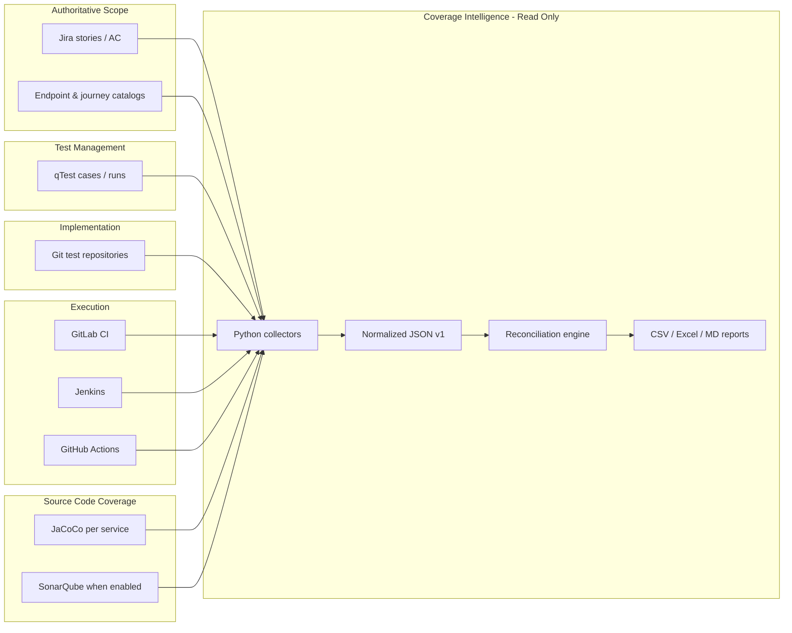

# Recommended Architecture — GS Coverage Intelligence

**Assessment date:** 2026-07-20  
**Status:** **Planned** (minimum viable)

## Conceptual architecture

## Component responsibilities

| Layer | Responsibility | Technology |
|-------|----------------|------------|
| **Collectors** | Pull read-only snapshots on schedule | Python 3, `requests`, existing UP/GS scripts |
| **Normalization** | Map to schema v1: `scope_id`, `test_id`, `repo_ref`, `pipeline_ref`, `metric_type` | JSON files in git-excluded dir |
| **Reconciliation** | Deterministic match first; fuzzy → `candidate` flag | Python + CSV output |
| **Reporting** | Leadership summaries; no blended % | Markdown + openpyxl |
| **Governance** | Formulas, owners, SLAs | Markdown in `09-governance/` |

## Data flow (weekly cadence recommended)

1. **Sunday:** qTest + Jira collectors (when creds available)  
2. **Daily:** GitLab pipeline status collector  
3. **On commit:** Repo inventory parser (optional webhook later)  
4. **Monday:** Reconciliation job → `gs-reconciliation-report.csv`  
5. **Monday:** Leadership digest → `10-leadership/executive-summary.md` (auto-sections)

## Security boundaries

- Read-only API tokens  
- Output in `coverage-intelligence-assessment/` (git-excluded)  
- No credentials in source control  
- No writes to qTest/Jira/CI systems from collectors  

## Integration preference order

1. Filesystem / git clone (repos) — **Available**  
2. GitLab REST — after valid PAT  
3. qTest REST — after `QTEST_*` env  
4. Jira REST — after MCP fix or token  
5. Jenkins — exported configs until API available  

## Not in scope (Phase 1)

- Web dashboard  
- Central database  
- Blocking gates (reporting only first)  
- Real-time streaming  

---

*Aligns with `government-savings-automation-assessment` and `universal-platform-coverage` patterns.*
