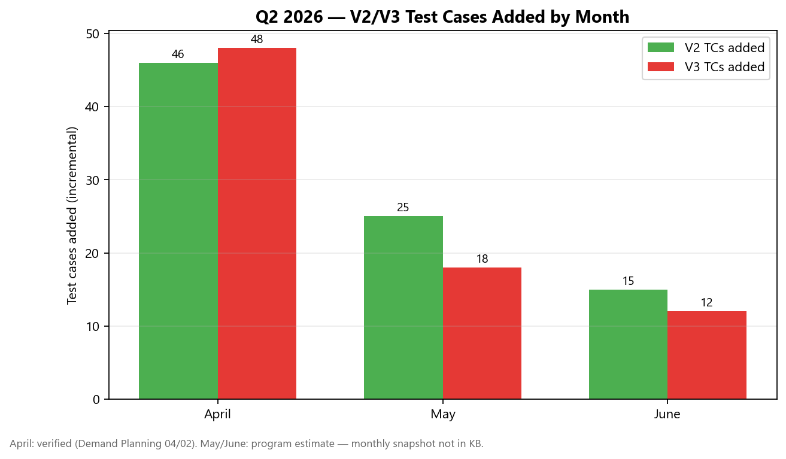
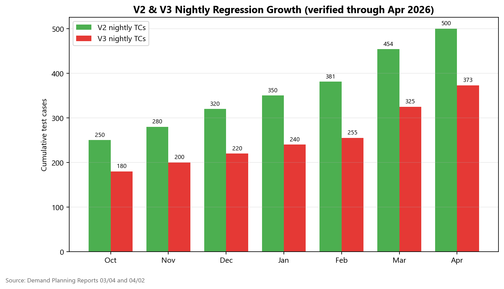
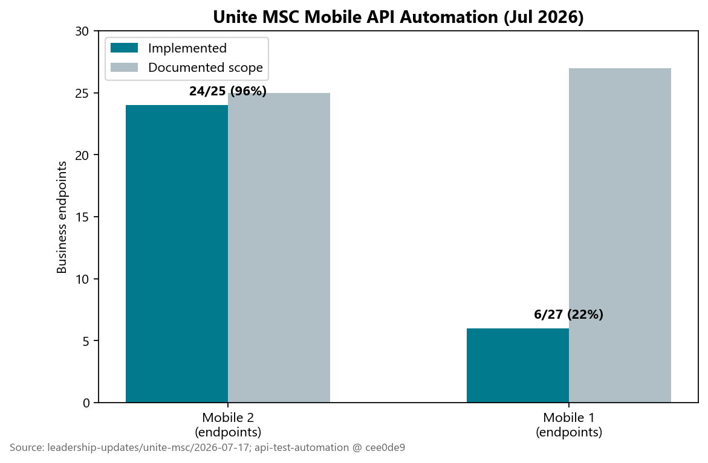
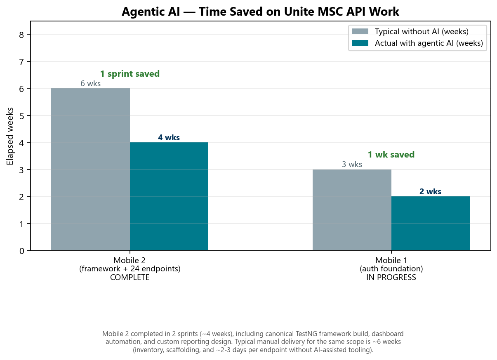

# Bi-Weekly QA Automation Leadership Update

**For:** Michael Blake, Dhanashree Dalal (via Piyush)  
**Prepared by:** Swapnil Patil — QA Automation & Quality Program Lead, Government Savings  
**Date:** July 23, 2026  
**Meeting:** Persistent bi-weekly leadership sync  
**Distribution:** Teams + Confluence reference

---

## Executive Summary

| Area | Headline |
|------|----------|
| **V2 nightly regression** | **~500 TCs** at end of April; transfer complete; exchange ~90%; investment options closed in May |
| **V3 nightly regression** | **373 TCs** at end of April (IDP 33 + UE 325 + Unite +15); stabilization and pipeline integration through Q2 |
| **Q2 TC velocity (Apr–Jun)** | **~164 TCs added** across V2/V3 (April verified; May/June program estimate) |
| **Unite MSC Mobile** | **Mobile 2: 24/25 endpoints (96%)** implemented; **Mobile 1: 6/27 (22%)** — active sprint |
| **Agentic AI** | Mobile 2 delivered in **2 sprints (~4 weeks)** incl. framework, dashboard automation, and custom reporting design; typical without AI **~6 weeks** — **1 sprint saved** |
| **Performance program (Priti)** | **New perf regulations + DoD** established; **nightly Jenkins regression live** (Stage 1); perf now part of every feature delivery |
| **Pipelines** | GitHub Actions API live; Unite Prime pipeline live; Mobile 2 GHA Dashboard slice validated |

---

## 1. V2 & V3 Test Cases Added — Apr, May, June 2026

### Monthly incremental adds (what Dhanashree asked for)

| Month | V2 TCs added | V3 TCs added | Combined | Confidence | Primary evidence |
|-------|-------------:|-------------:|---------:|------------|------------------|
| **April** | **46** | **48** | **94** | **Verified** | Demand Planning Report 04/02/2026 (454→500 V2; 325→373 V3) |
| **May** | **~25** | **~18** | **~43** | Program estimate | Investment options + exchange closure; May V2 regression gap pack (10 stories) |
| **June** | **~15** | **~12** | **~27** | Program estimate | Stabilization sprint; regression triage (QA-1016/1017, QA-1235–1242) |
| **Q2 total** | **~86** | **~78** | **~164** | Mixed | April verified + May/June estimates (no monthly snapshot in KB) |

> **Note:** April numbers are verified from leadership Demand Planning reports. May and June do not have a formal monthly nightly-count export in the KB — estimates reflect sprint delivery, JIRA activity, and team reports. GitLab nightly count export will tighten these figures.

### Chart — Q2 monthly TC adds



### Chart — Cumulative nightly regression growth (context)



### Mermaid — stacked view (Apr–Jun focus)

```mermaid
xychart-beta
    title "Q2 2026 — Test Cases Added per Month"
    x-axis ["April", "May", "June"]
    y-axis "TCs Added" 0 --> 55
    bar [46, 25, 15]
    bar [48, 18, 12]
```



---

## 2. What Was Delivered — V2 (Prime)

| Workstream | Apr | May | Jun | Status |
|------------|-----|-----|-----|--------|
| Transfer automation | Complete | — | — | Done |
| Exchange coverage | ~90% | Closed | Stable | Done |
| Investment options | In flight | Closed | Stable | Done |
| PAG / GSP enrollment gaps | — | Scoped (10 stories) | In progress | In progress |
| Ugift / CSR gaps | — | QA-626/627 | Nightly follow-through | In progress |
| Multi-environment (CAT) | Smoke created | C5 → CAT | Lighter CSR suite | In progress |
| Nightly regression | **~500 TCs** | Maintained | Stable + triage | Stable |

**Key JIRA (Q2):** QA-494 (Transfer), QA-708 (Stage 1 multi-area), May 2026 V2 regression gap pack (10 stories), QA-1017 (Jun multi-module).

**Owner:** Venkatesh Mallela (V2 transactions, exchange, investment options).

---

## 3. What Was Delivered — V3 (Prime / Universal Platform)

| Workstream | Apr | May | Jun | Status |
|------------|-----|-----|-----|--------|
| IDP nightly TCs | 33 | Stable | Stable | Stable |
| Universal Enrollment | 325 | Expanded | Stable | Stable |
| Unite V3 | +15 new | Growing | Stable | Stable |
| CSR account maintenance | Added | Stable | Stable | Stable |
| Web registration / profile | — | Added | Stable | Stable |
| Flaky remediation | Ongoing | Ongoing | QA-1235–1242 | In progress |
| UP-scoped inventory | — | — | **379 / 436 (86.9%)** | Verified Jun 29 |

**Key JIRA (Q2):** QA-703/708 (UE/IDP), QA-635 (IDP port to V3), QA-1016 (UE system error), QA-1235–1242 (UI regression Jun 25).

**Owner:** Dinesh Kumar (V3 UE/IDP/Unite).

---

## 4. Unite MSC Mobile — Delivery & AI Impact

### Coverage snapshot (July 2026)

| Track | Implemented | Scope | % | Notes |
|-------|------------:|------:|--:|-------|
| **Mobile 2 API** | 24 | 25 | **96%** | Sign-off baseline 22/25 (88%) Jul 14; YTD + Banks GET-by-id added |
| **Mobile 1 API** | 6 | 27 | **22%** | Auth foundation on `main`; business endpoints in sprint |
| **MSC perf (Jenkins)** | 1 flow | — | — | QA-1229 Done Jul 2 (non-IDP login → Dashboard) |
| **GHA pipeline** | Dashboard slice | — | — | Chaitanya validated vertical slice |



### Agentic AI — practical delivery comparison

| Workstream | Typical without AI | With agentic AI (actual) | Notes |
|------------|-------------------:|-------------------------:|-------|
| Mobile 2 — framework + 24 endpoints | ~6 weeks | **4 weeks** (2 sprints) | Framework, dashboard automation, custom reporting design |
| Mobile 1 — auth + bootstrap | ~8 weeks | **4 weeks** (in progress) | Auth on `main`; 6/27 endpoints so far |
| Per-endpoint delivery | ~2–3 days each | **~1 day each** | After framework in place |
| Full MSC program (incl. enrollment) | ~20+ weeks | **~11–12 weeks** (program estimate) | Enrollment multi-sprint |



**How AI helped (leadership-safe):**
- Faster inventory and TestNG scaffolding from legacy Cucumber
- Endpoint test classes and suite wiring accelerated — most endpoints in about a day once framework exists
- Execution proof still manual on QC4/Stage 1 before sign-off

**Guardrail:** *AI assists; humans prove.* All tests require manual execution evidence on QC4/Stage 1 before sign-off.

---

## 5a. Performance Testing Program — Priti Choudhary (major Q2 achievement)

**Before Q2:** No unified performance testing regulations, no team-wide Definition of Done for perf, and no recurring nightly performance regression job for the automation program.

**What Priti delivered:**

| Deliverable | What it means | Status |
|-------------|---------------|--------|
| **Performance testing regulations** | Documented standards for how perf tests are authored, parameterized, and promoted — did not exist before | **Established** |
| **Performance DoD & best practices** | Clear Definition of Done for automation team — any feature we automate now includes a performance testing path where applicable | **Active** |
| **Nightly performance regression (Jenkins)** | `AGSUP_IDP_REGRESSION_SUITE` runs **weekdays ~3 AM** on Stage 1 load servers (`loadtestwt1` + `loadtestwt2`) | **Live** |
| **IDP perf suite in nightly** | IDP Login Resources, Auth Server Delay, Forgot Username flows in scheduled orchestrator | **Running** |
| **Unite MSC perf foundation** | `AGSUP_UNITE_MSC_ENDURANCE` — non-IDP login → Dashboard (QA-1229 Done Jul 2); expanding to more Mobile 2 flows | **Deployed** |
| **Expand-to-nightly model** | New perf scripts added incrementally to the regression suite as features land (Dashboard, Contribution, Banks, Mobile 1 next) | **Ongoing** |

**Why this matters for leadership:**
- Performance is no longer ad hoc — it is a **governed part of the automation program**, same as functional nightly regression.
- **Nightly job running in Stage 1** is a significant operational milestone; coverage will grow as new flows are onboarded.
- Functional + performance together raise confidence for release readiness across V2, V3, and Unite MSC.

**Evidence:** `mobile2-api-db-validation/docs/01-shared/unite-msc-performance-testing-tracker.md`; Jenkins `AGSUP_IDP_REGRESSION_SUITE` (weekdays); QA-1229.

---

## 5. Team Kudos — Q2 2026

| Team member | Contribution | Period |
|-------------|-------------|--------|
| **Venkatesh Mallela** | V2 → 454 then ~500 nightly TCs; transfer, exchange, fund allocation, investment portfolio | Apr–Jun |
| **Dinesh Kumar** | V3 → 373 nightly TCs; IDP/UE stabilization; Unite +15; CSR personal info; Mobile 2 plans/content/YTD | Apr–Jun |
| **Sunil Godiyal** | API transfer coverage; Mobile 2 banks/stackup/transaction history/investments (sign-off anchor QA-1310) | Q2 |
| **Priti Choudhary** | **Created performance testing regulations + DoD/best practices** (new for the team); **nightly perf regression live** on Jenkins Stage 1 (`AGSUP_IDP_REGRESSION_SUITE`); Forgot Username complete; MSC endurance job (QA-1229); perf now required on every feature delivery | Q2 — **standout achievement** |
| **Swapnil Patil** | Program architecture, master suite wiring, dynamic auth SQL, GHA slice, KB leadership reporting | Q2 |
| **Chaitanya (DevOps)** | Mobile 2 Dashboard GHA vertical slice validated | Jul |
| **Pramod** | Whitecap TCs + CI/CD integration | Apr |

---

## 6. Pipelines & Cross-Team (Q2 highlights)

| Milestone | Status | When |
|-----------|--------|------|
| API pipeline (GitHub Actions) | Deployed | Mar–Apr |
| Unite Prime pipeline | Live | Apr |
| CAT / Stage 5 smoke (V2 CSR + V3 IDP/UE) | Created | Mar–Apr |
| IDP login performance (Jenkins) | **Scheduled weekdays ~3 AM — nightly regression live (Stage 1)** | Q2 |
| Perf regulations + DoD | **Established by Priti — perf required per feature** | Q2 |
| MSC non-IDP login → Dashboard perf | Deployed (QA-1229) | Jul |
| Mobile 2 GHA Dashboard slice | Validated | Jul |
| GitLab nightly Mobile 2 (QA-1405) | Pending DevOps | Jul |

---

## 7. Risks & Leadership Asks

| Risk | Impact | Ask |
|------|--------|-----|
| No GitLab nightly Mobile 2 job | Manual regression burden | Approve QA-1405 DevOps story |
| QC4 IDP mobile login 401 | Blocks QC4 pipeline gate | Infinity team investigation (in progress) |
| May/Jun TC counts not snapshotted | Leadership reporting gap | GitLab nightly count export cadence |
| Growing regression volume | Triage capacity | Protect SME + offshore nightly ownership |

---

## 8. Evidence Sources

| Source | Path |
|--------|------|
| Apr Demand Planning | `10_IMPORTS_RAW/confluence_exports/Demand Planning Reports/17. QA Automation Program – 04022026.md` |
| Mar Demand Planning | `.../16. QA Automation Program – 03042026.md` |
| UP inventory (Jun) | `universal-platform-coverage/01-analysis/10-reconciliation-ledger.md` |
| Mobile MSC Jul update | `leadership-updates/unite-msc/2026-07-17-leadership-update/` |
| May V2 gaps | `docs/jira-governance/upcoming-stories/MAY-2026-V2-Regression-Gaps/` |
| AI framing | `docs/mobile-automation-program-hub/04-migration-strategy.md` |

---

## 9. Teams Message (copy/paste for Dhanashree)

```
Hi Dhanashree,

Sharing the bi-weekly QA Automation update for tomorrow's call with Blake.

📊 V2/V3 test cases added (Apr–Jun):
• April: +46 V2, +48 V3 (94 total) — verified
• May: ~+25 V2, ~+18 V3 (~43 total) — program estimate
• June: ~+15 V2, ~+12 V3 (~27 total) — stabilization focus
• Q2 combined: ~164 TCs added | Nightly suite at Apr end: V2 ~500 + V3 373 = ~873+

📈 Charts attached:
1) Q2 monthly TC adds (V2 vs V3)
2) Cumulative nightly growth through April
3) Mobile 2 (24/25) & Mobile 1 (6/27) coverage
4) Agentic AI impact — Mobile 2 in 4 weeks (2 sprints) vs ~6 weeks typical — **1 sprint saved**

✅ Highlights:
• V2: Transfer complete, exchange closed, investment options done
• V3: 373 nightly TCs; IDP/UE stable; UP inventory 379/436 (86.9%)
• Mobile 2: 96% endpoints implemented; sign-off path active
• Pipelines: API GHA live, Unite Prime live, MSC perf Jenkins (QA-1229)
• Performance program (Priti): regulations + DoD established; nightly perf regression LIVE on Jenkins Stage 1 (weekdays); perf now part of every feature delivery

🙌 Kudos:
• Priti — standout: built perf regulations/DoD from scratch; nightly regression job running; expanding coverage each sprint
• Venkatesh (V2 velocity), Dinesh (V3 + Mobile 2), Sunil G (Banks/investments), Chaitanya (GHA slice)

Full detail + chart files: leadership-updates/2026-07-23-bi-weekly-blake/

Thanks,
Swapnil
```

---

## 10. How to Share in Teams

1. Paste the **Teams message** (Section 9) into the chat with Dhanashree.
2. Attach these 4 PNGs from `_assets/`:
   - `chart_q2_monthly_adds.png` ← **primary chart she asked for**
   - `chart_v2_v3_cumulative.png`
   - `chart_mobile_msc_coverage.png`
   - `chart_ai_productivity.png`
3. Optional: link this MD file in the repo for Blake's reference.

---

*Regenerate charts: `python leadership-updates/2026-07-23-bi-weekly-blake/generate_charts.py`*
