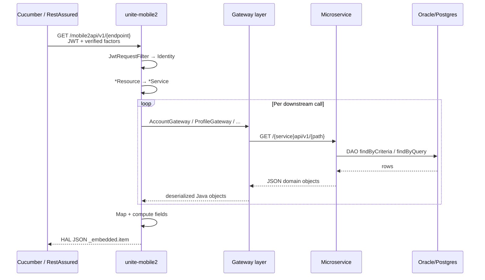

# BFF orchestration flow

How `unite-mobile2` assembles responses: REST resource → service → gateway HTTP → microservice resource → service → DAO/SQL.

## Request lifecycle



## REST resource registration

`RESTApplication.java` registers all mobile2 resources at startup:

| Resource class | Typical path segment |
|----------------|---------------------|
| `MobileDashboardResource` | `mobiledashboard`, `mobileytdsummary`, `mobilemembers` |
| `MobileBankResource` | `mobilebanks` |
| `MobileContributionResource` | `mobilecontribution` |
| `MobileActivityResource` | `mobileactivity` |
| `MobileTransactionHistoryResource` | `mobiletransactionhistory` |
| `MobilePerformanceResource` | `mobileperformance` |
| `MobileBalanceTrendResource` | `mobilebalancetrend` |
| `MobileStackupResource` | `mobilestackup` |
| `MobileUgiftResource` | `mobileugift` |
| `InvestmentResource` | `investments` |
| `PlanSelectionResource` | `plans` |
| `ContentResource` | `content` |

Base URL pattern: `{MOBILE2_SERVICE_URL}/mobile2api/v1/`

## Gateway JWT roles

| Call type | JWT role | Example |
|-----------|----------|---------|
| Member-scoped account/transaction reads | `MEMBER` | `AccountGateway.getAccountsByMemberId` |
| Trusted lookup (member by username) | `ASCENSUS_COLLABORATOR` | `AccountGateway.getMember(planId, username)` |
| Acceptance test member session | special acceptance token | `Mobile2BaseStepDefs.jwtAcceptanceTestRequest` |

## Example: Mobile Dashboard chain

```
GET /mobile2api/v1/mobiledashboard
  → MobileDashboardResource
  → MobileDashboardService.getMobileDashboard(identity)
      → AccountGateway.getAccountsByMemberId(?includeFundPositions=true)
          → unite-account GET /accountapi/v1/accounts
              → AccountService → AccountDao.getAccountsByMemberId (ORM tu_acct)
              → FundPositionService.getPositionsByMemberId (ORM view + metadata prices)
      → ProfileGateway.getOwner(seqPartId)
          → unite-profile GET /profileapi/v1/owners/{id}
              → OwnerService → PersonTable ORM (tu_person)
      → ProfileGateway.getBeneficiary(seqBeneId) [per account]
          → unite-profile GET /profileapi/v1/beneficiaries/{id}
              → BeneficiaryService → BeneficiaryTable ORM (tu_bene)
      → MetadataGateway.getPlanByTraunchId(traunchId)
          → unite-metadata GET /metadataapi/v1/plans/traunch/{deprecatedId}
              → PlanService → TraunchTable ORM (tu_traunch)
      → OnPremAccountGateway.getAccountByAccountNumber(prefix, branding)
          → agsup-account-web (external)
              → mobileBanks, withdrawal balances, matching grants
      → Java computed: totalBalance, mobileUgifts[], matching grant merge, displayInStackup
```

## Filtering logic (BFF-only)

`MobileDashboardService` skips accounts where:

- `acctState` fails `MobileAccount.canDisplayToOwner()`
- `enrollStatus == REJECTED`

Validation SQL for account lists must apply the same filters when comparing `mobileAccounts[]` length and membership.

## Price enrichment path

Fund positions in account service call metadata for prices:

```
FundPositionService.getPositionsByMemberId
  → accountDAO.findByCriteria(uiiMemberId) → tu_acct
  → fundBalanceViewDao.findByCriteria → tu_fund_balance + tu_acct join
  → metadatagateway.getPlanByDeprecatedId(traunchId) → tu_traunch.branding, asof_date
  → metadatagateway.getFundPrices(planId, asofDate) → tu_fund_price + tu_funds
  → fundValue = units * price (per position)
```

BFF `loadPositions` sums `fundPrice * fundUnits` with scale 2 HALF_UP — same rule as validation SQL.

## Tracing checklist

When documenting a new endpoint:

1. Find `@Path` in `*Resource.java`.
2. Read `*Service.java` for gateway calls and Java-only fields.
3. Open matching `*Gateway.java` for downstream URL template.
4. In target microservice: `*Resource.java` → `*Service.java` → `*Dao.java` / `*.xml`.
5. Note ORM `@Table` vs explicit XML query name.
