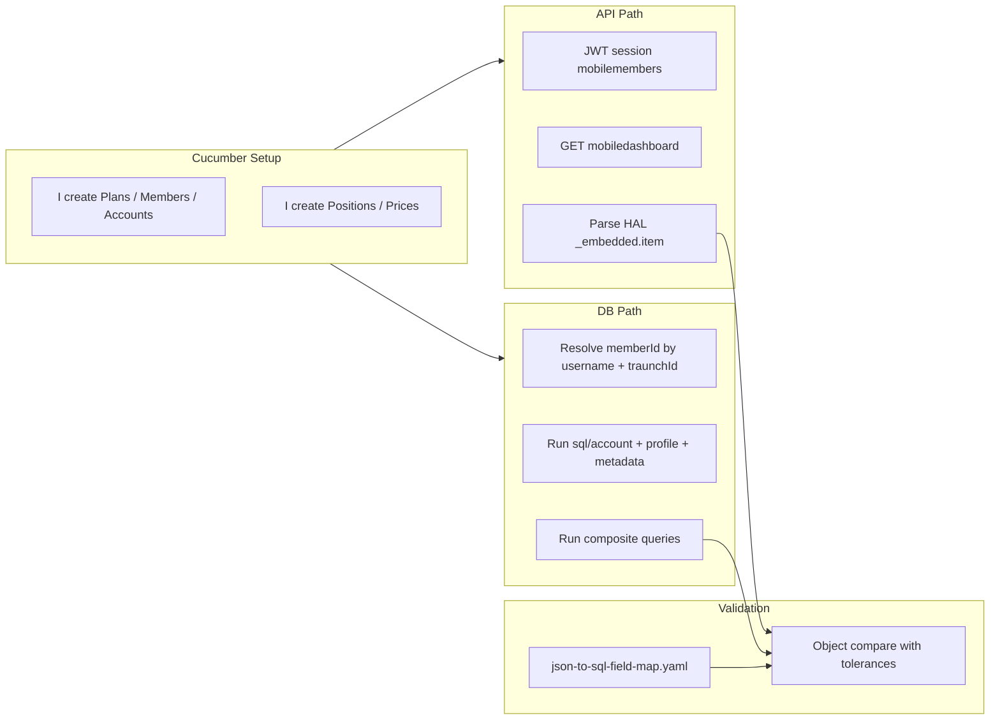

# API response vs DB validation data flow

How Cucumber API assertions relate to independent SQL validation.

## Comparison model



## Parallel execution

API and DB paths are **independent**:

1. Cucumber setup writes to the same tables both paths read.
2. API path goes through BFF + gateways (includes on-prem and computed fields).
3. DB path runs KB SQL with bind variables from setup (`ssgauser01`, `100001`, `A90800208`, `01`).

Do not use API response values as SQL inputs except for resolving IDs when setup does not expose them (document those cases).

## Field categories

| Category | Compare strategy | Example |
|----------|------------------|---------|
| **Direct DB** | Column ↔ JSON field | `ownerFirstName` ↔ `tu_person.first_name` |
| **Joined DB** | Composite SQL ↔ JSON | `acctBalance` ↔ SUM(units × price) |
| **BFF computed** | Validate components | `totalBalance` = SUM(acctBalance) after filters |
| **On-prem** | Skip or separate env check | `mobileBanks`, `availBalanceForWithdrawal` |
| **CMS** | Skip DB | `content` HTML |
| **Formatted** | Transform before compare | `asOfDate` MM/dd/yyyy from plan.asof_date |

## HAL JSON path

Step definitions parse responses with:

```java
JsonUtil.getObject(response, JsonUtil.EMBEDDED_ITEM, MobileDashboard.class);
```

Validation framework should map flattened JSON paths:

- `ownerFirstName` (root dashboard)
- `mobileAccounts[0].beneFirstName`
- `mobileAccounts[0].acctBalance`

## Multi-datasource joins

Composite queries may require **logical joins** across datasources (separate JDBC connections in production). KB composite SQL documents intended joins; execution may be:

1. Run per-repo queries in framework.
2. Merge in validation layer (preferred for true multi-DB).
3. Single SQL where schemas are co-located in test DB (common in integration env).

Document which approach your environment supports in scenario notes.

## Failure triage

| Symptom | Likely layer |
|---------|--------------|
| Account count mismatch | BFF filter (acctState/enrollStatus) or setup |
| Balance off by rounding | Scale/HALF_UP on per-fund vs total |
| asOfDate mismatch | PATAP on-prem path vs metadata plan.asof_date |
| Owner name wrong | seqPartId from last qualifying account loop |
| Banks present in API only | OnPremAccountGateway — expected skip for DB |
