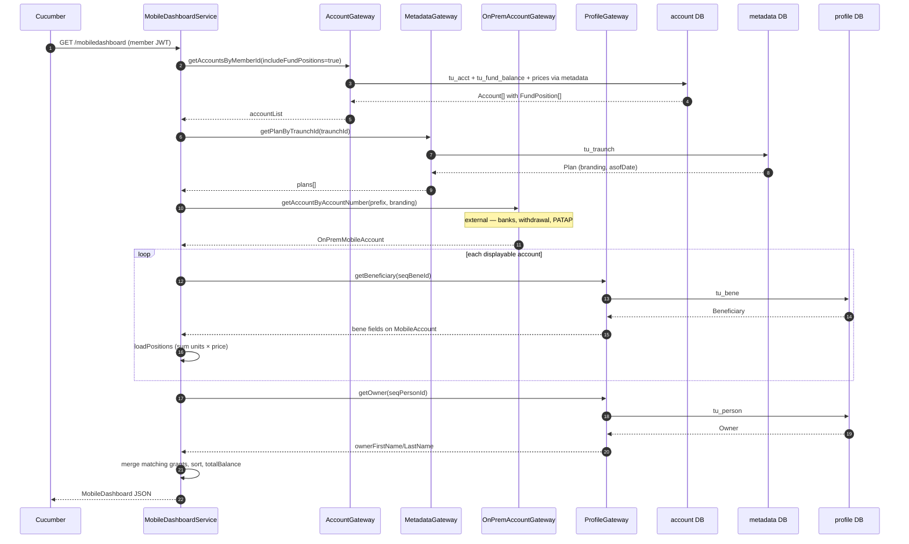
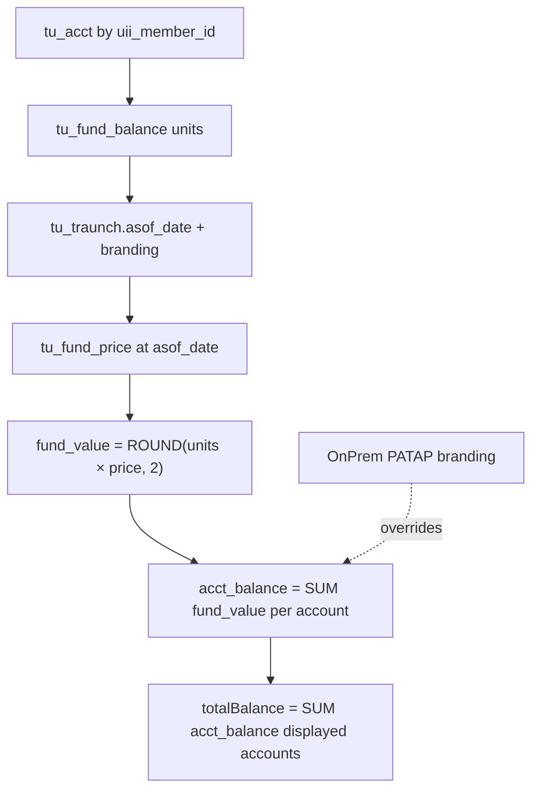
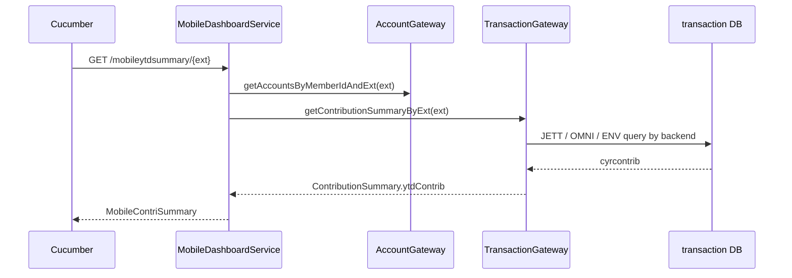

# Mobile Dashboard — flow diagram

## Sequence: GET mobiledashboard

## Balance calculation flow

## YTD summary flow (@md13–@md15)

## Related docs

- Orchestration detail: `docs/00-architecture/bff-orchestration-flow.md`
- External/on-prem: `docs/00-architecture/external-systems.md`
- Field mapping tables: `api-to-db-mapping.md`
