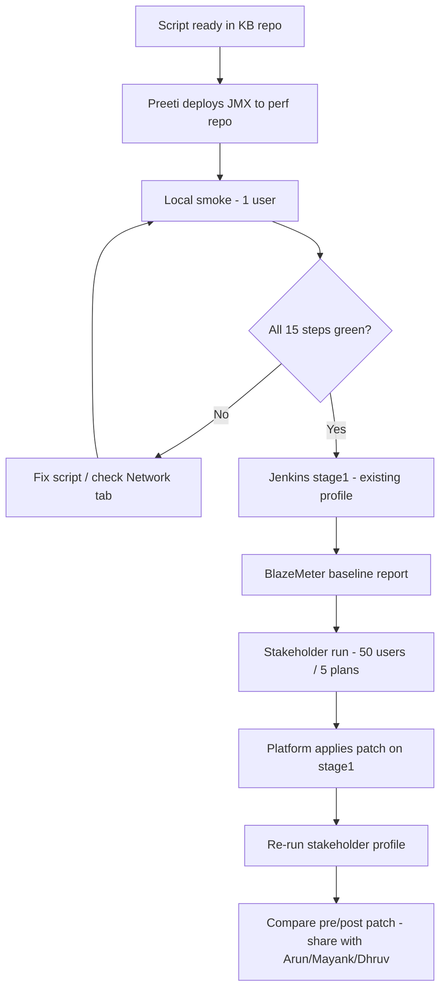

# Workflow — IDP Login Banner Performance Test

## Overview

## Phase 1 — Script delivery (done)

- [x] Analyze existing `idp-login-resources.jmx`
- [x] Add 6 post-login `.cs` GET samplers
- [x] Package in `scripts/jia-banner-post-login/`
- [x] Documentation for Preeti

## Phase 2 — Deploy & smoke (Preeti)

| Step | Owner | Output |
|------|-------|--------|
| Copy JMX to perf repo | Preeti | Git commit |
| Local 1-user test (nyd) | Preeti | Screenshot / JTL |
| Browser Network tab compare | Preeti | Confirm URLs match script |
| 2nd plan smoke (njd or nmd) | Preeti | Pass/fail |

**Exit criteria:** 0% errors on all 15 labels for 2 plans.

## Phase 3 — Jenkins validation (existing profile)

| Parameter | Value |
|-----------|-------|
| Job | `AGSUP_ENDURANCE_THROUGHPUT` |
| concurrency | 25 |
| ramp | 5m |
| duration | 1h |
| environment | stage1 |

**Exit criteria:** BlazeMeter shows 15 labels; error % ≤ baseline + 0.5%.

## Phase 4 — Stakeholder load test

| Parameter | Target | Status |
|-----------|--------|--------|
| Plans | 5 distinct | Confirm with Arun |
| Users | 50 parallel | Confirm split per plan |
| Ramp | 5 minutes | |
| Duration | 5 minutes (?) | **Open item** |
| Focus | `customBannerMessage.cs` | All 6 pages in script |

**Exit criteria:** BlazeMeter report shared with platform team.

## Phase 5 — Patch comparison

1. Save Phase 4 report as **pre-patch baseline**
2. Platform deploys patch to stage1
3. Re-run Phase 4 with identical parameters
4. Compare p90/p95 for steps 8-A-1 through 8-A-6
5. Document in Teams + update `docs/reference/BASELINE_RESULTS.md`

## Roles

| Role | Person |
|------|--------|
| Script / Jenkins execution | Preeti |
| Coordination / docs | Swapnil |
| Banner endpoints / Network tab | Mayank, Dhruv |
| Load profile approval | Arun |
| Patch deployment | Platform team |

## Related

- [PRITI_HANDOFF.md](../PRITI_HANDOFF.md)
- [Open Items](../open-items/OPEN_ITEMS.md)
- [Investigation brief](../../investigations/jia-banner-post-login-pages/README.md)
