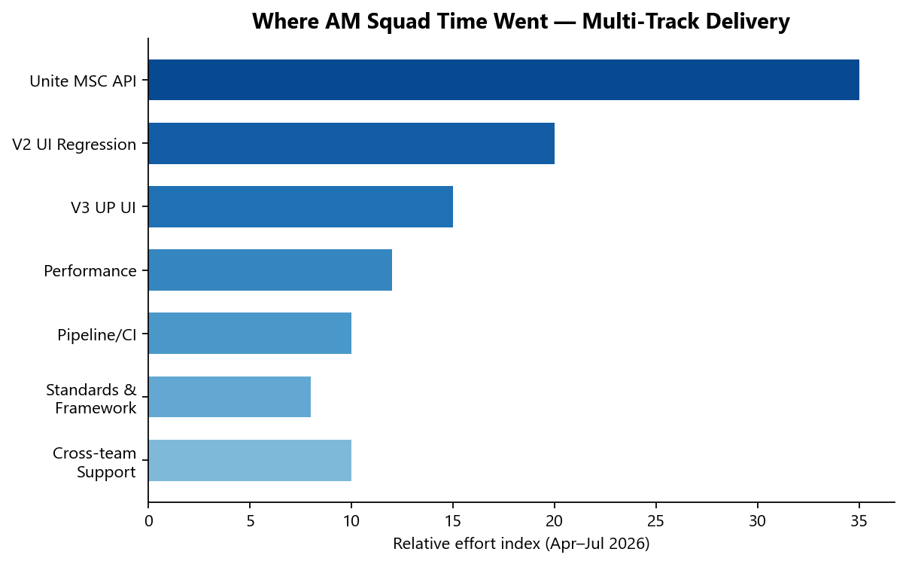

# Executive Summary — AM Squad (QA Automation)

**Period:** April – August 2026 | **Audience:** VP / Director | **Date:** August 5, 2026

---

## The headline

AM Squad operates across **six parallel tracks** — not a single regression number. While V2/V3 UI test counts reflect maintenance and suite curation (some modules intentionally removed or consolidated), **delivery shifted heavily into API automation (Unite MSC), performance baselines, pipeline integration, and department-wide standards** — areas that do not show up in traditional UI regression metrics.

> **116 merged GitLab MRs** to `main` across three automation repos (Apr 1 – Aug 4, 2026). Peak delivery in **June–July** aligned with Unite MSC API sprint.

---

## Scorecard at a glance

| Area | Key metric | Status |
|------|-----------|--------|
| **V2 Legacy UI** | **592** test methods in Stage1 nightly (12 modules) | Operational — nightly Mon–Fri |
| **V3 Universal Platform** | GitLab scheduled regression + **379** UP-scoped TestNG cases | Operational — IDP/entity expansion |
| **API / Unite MSC** | Mobile 2: **24/25 endpoints (96%)**; Mobile 1: **18/27 (67%)** | M2 sign-off ready; M1 active |
| **Performance** | **6+ scheduled regression scenarios** (IDP, legacy, MSC) | Baselines established; expansion in flight |
| **Pipeline / CI** | Enrollment + metadata in hub pipeline; M2 GHA vertical slice | Module-by-module onboarding |
| **Release automation** | **~80%** of monthly release validations automated (was 17 FTE → **2 FTE**) | Production-proven |
| **Standards** | qTest master suite, bug lifecycle playbook, perf DoD | Enforced across QA |

---

## Top 5 deliverables (Apr–Jul)

### 1. Unite MSC — rescued and accelerated (~50% time savings)

Legacy `unite-mobile2` Cucumber was tightly coupled to the monolith, had no Postman docs, no IDP plan support, and sat with another team past ETA. AM Squad:

- Designed a **canonical TestNG API framework** (`api-test-automation/mobile/`)
- Used **AI agents** for documentation, Postman collections, data utils, and migration boilerplate
- Delivered **Mobile 2 baseline in ~50% of original ETA** with IDP/NMD branding support
- Mobile 1 sprint now at **18 endpoints** (auth, profile, biometric, push notifications, close account)

### 2. V2 regression — breadth over raw count

Added and stabilized **CSR modules** previously missing from nightly: Fee Entry, Single/Multiple Contribution, Authorize Agent, Security Questions, Payroll Deduction, Ugift multi-plan, GSP enrollment, and more. Suite curation (removing obsolete cases) keeps the denominator honest — **592 methods across 12 modules** running nightly.

### 3. V3 Universal Platform — IDP and entity tracks

Dinesh Kumar led V3 expansion: entity registration/login suites, IDP open-account (MIB), member withdrawal regression, web registration flow, flaky-test stabilization. **26 MRs** to `prime-test-automation` in period.

### 4. Performance testing — from zero to regression suite

Priti Choudhary established department perf standards and delivered:

- **IDP login resources**, auth-server delay, forgot-username/password (scheduled regression)
- **Legacy non-IDP login** baselines
- **Unite MSC** non-IDP + IDP login perf (Jenkins `AGSUP_UNITE_MSC_ENDURANCE`)
- **Barcode SYN-443** — full perf cycle in **one week** (emergency)

### 5. Standards that outlive any sprint

- **qTest master suite plan** — folder structure, enforcement across QAs (migrated to SharePoint)
- **Automation Bug Lifecycle** standard — triage → JIRA → leadership email → GitLab investigation
- **API framework** + **Performance DoD** — folder structure, Jenkins patterns, BlazeMeter reporting

---

## What the numbers don't capture

| Investment | Why it matters |
|-----------|----------------|
| Framework architecture (API, perf, qTest) | Enables 50% MSC migration savings; not a GitLab line item |
| Pipeline/DevOps co-design | Module switches, dashboard reporting, hub workflow — weeks of cross-team work |
| Revolt group code reviews | Cross-team quality gate — reviews not counted as MRs |
| Emergency intake (Empower, barcode, JEA proxy) | Repeated ad-hoc pulls from sprint capacity |

---

## Leadership asks

1. **Clear roadmap** — involve AM Squad at SDLC start, not end-of-sprint emergency
2. **Admin capacity** — dedicated support so technical lead can focus on architecture, not pack assembly

See [04-leadership-asks.md](./04-leadership-asks.md) for detail.

---

## Visual summary

