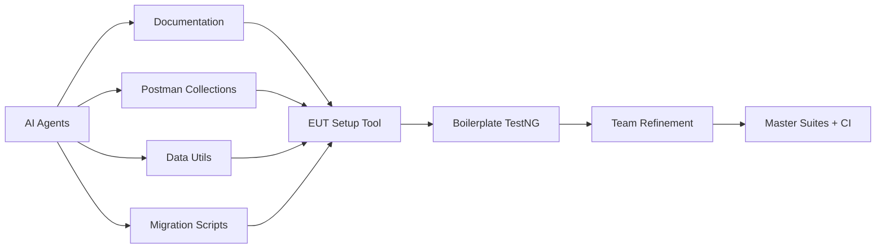

# API Automation — Unite MSC

**Owner:** Swapnil Patil (framework/architecture), Sunil Godiyal + Venkatesh Mallela + Dinesh Kumar (test development)  
**Repository:** [api-test-automation](https://gitlab.com/ascensus-gs/products/depot/qa-automation/api-test-automation)  
**Program KB:** `programs/unite-msc/`

---

## Problem statement (before AM Squad)

| Challenge | Impact |
|-----------|--------|
| Legacy `unite-mobile2` Cucumber **tightly coupled** to monolith codebase | Could not migrate independently |
| **No Postman documentation** | Zero API contract baseline |
| **No IDP plan support** in legacy tests | Gap for current product direction |
| Prior team **missed ETA** | Project handed to AM Squad mid-flight |
| Team lacked MSC **domain knowledge** | High KT dependency risk |

---

## Solution — phased delivery with AI acceleration

| Phase | Deliverable | Outcome |
|-------|-------------|---------|
| 1 | Framework skeleton (QA-987) | Canonical `mobile/mobile1` + `mobile/mobile2` structure |
| 2 | Auth baseline (OKD + NMD + IDP) | Reusable token client, dynamic SQL test data |
| 3 | Mobile 2 module migration | Dashboard → Activity → Banks → Contribution → … |
| 4 | Master integration + regression suites | `master-regression-testng.xml` — 36+ classes |
| 5 | Mobile 1 sprint | Auth → profile → biometric → push → close account |
| 6 | Pipeline (GHA/Nexus) | Vertical slice complete; module expansion in progress |

**Result:** Delivered in approximately **50% of original ETA** using AI-generated boilerplate + team refinement on dynamic data.

---

## Coverage scorecard (August 2026)

### Mobile 2

| Metric | Value |
|--------|------:|
| Documented business endpoints | 25 |
| Automated endpoints | 24 |
| Coverage | **96%** |
| Master regression classes | 36 |
| Branding | OKD (`okdirect`) + NMD (`nmdirect`) |
| IDP path | **New capability** (not in legacy) |

### Mobile 1

| Metric | Value |
|--------|------:|
| Documented business endpoints | 27 |
| Automated endpoints | 18 |
| Coverage | **67%** |
| Completed areas | Auth (OKD/NMD/IDP/CSR/PIN), owner/profile, beneficiary, biometric, push notifications, close account, change password |

---

## Test categorization

| Tier | Suite | Purpose | Frequency |
|------|-------|---------|-----------|
| **Smoke** | Per-module smoke XML | Fast endpoint health check | On MR / manual |
| **Module regression** | Per-feature TestNG suite | Full endpoint validation per area | QC4 + Stage1 |
| **Master regression** | `master-regression-testng.xml` | Cross-module E2E API path | Pre-release |
| **Master integration** | `master-integration-testng.xml` | Wiring validation | CI pipeline |

---

## GitLab delivery (Apr–Aug 2026)

**48 MRs** to `api-test-automation` — peak in **June (19)** and **July (27)**.

| Month | MRs | Focus |
|-------|----:|-------|
| Apr | 0 | — |
| May | 0 | Framework kickoff (late May) |
| Jun | 19 | M2 framework + dashboard/activity/banks/contribution |
| Jul | 27 | M2 completion + M1 sprint |
| Aug | 2 | M1 biometric validation |

---

## Enrollment API (next)

Higher complexity — encrypted payloads, MFA-disabled accounts, dynamic test data utilities. Documented under `programs/unite-msc/msc-enrollment/`. Expected **>1 sprint**.

---

## Evidence

- Detailed MSC report: `programs/unite-msc/leadership/2026-07-17-leadership-update/leadership-update-detailed.md`
- Sign-off pack: `api-test-automation` → `17-mobile2-api-automation-signoff.md`
- Postman E2E: `programs/unite-msc/msc-enrollment/postman/`
