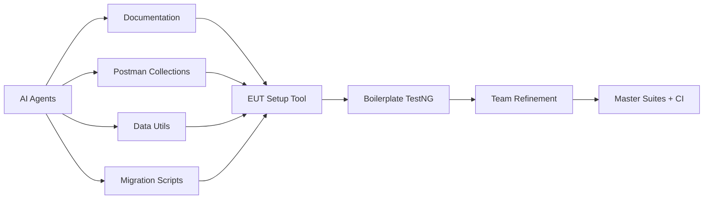
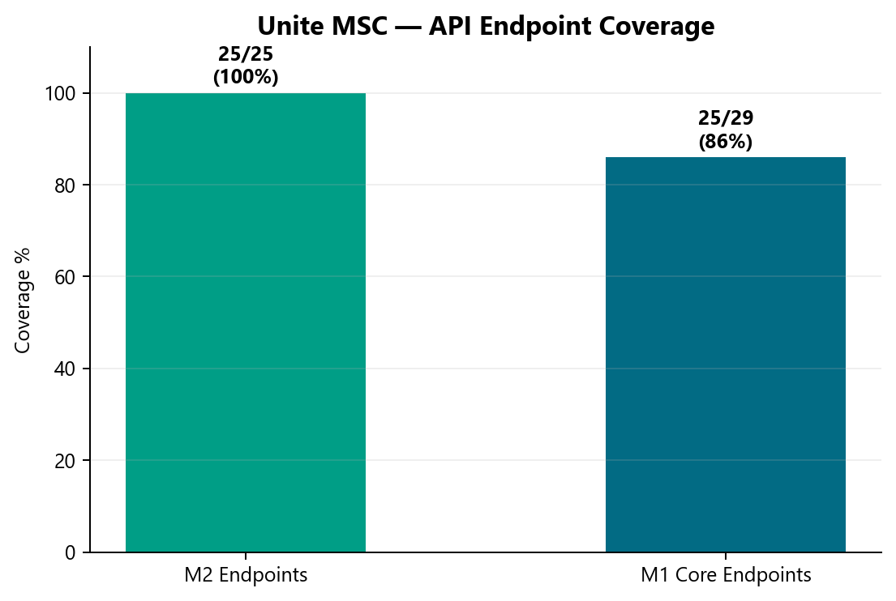

# API Automation — Unite MSC

**Owner:** Swapnil Patil (framework/architecture), Sunil Godiyal + Venkatesh Mallela + Dinesh Kumar (test development)  
**Repository:** [api-test-automation](https://gitlab.com/ascensus-gs/products/depot/qa-automation/api-test-automation)  
**Program KB:** `programs/unite-msc/`

---

## Problem statement (before AM Squad)

| Challenge | Impact |
|-----------|--------|
| Legacy `unite-mobile2` Cucumber **tightly coupled** to monolith codebase | Could not migrate independently |
| **No Postman documentation** | Zero API contract baseline |
| **No IDP plan support** in legacy tests | Gap for current product direction |
| Prior team **missed ETA** | Project handed to AM Squad mid-flight |
| Team lacked MSC **domain knowledge** | High KT dependency risk |

---

## Solution — phased delivery with AI acceleration

| Phase | Deliverable | Outcome |
|-------|-------------|---------|
| 1 | Framework skeleton (QA-987) | Canonical `mobile/mobile1` + `mobile/mobile2` structure |
| 2 | Auth baseline (OKD + NMD + IDP) | Reusable token client, dynamic SQL test data |
| 3 | Mobile 2 module migration | Dashboard → Activity → Banks → Contribution → … |
| 4 | Master integration + regression suites | `master-regression-testng.xml` + `master-integration-testng.xml` — 33 test blocks, 18 endpoint classes |
| 5 | Mobile 1 sprint | Auth → profile → biometric → push → close account |
| 6 | Pipeline (GHA/Nexus) | Vertical slice complete; module expansion in progress |

**Result:** Delivered in approximately **50% of original ETA** using AI-generated boilerplate + team refinement on dynamic data.

---

## Coverage scorecard (August 2026)

> **Repo source:** `api-test-automation/mobile/mobile2` + `mobile/mobile1` — verified against `master-regression-testng.xml`, `mobile2-smoke-testng.xml`, and `programs/government-savings-assessment/01-inventory/mobile2-endpoint-current-state.csv`.

### Mobile 2 — endpoints

| Metric | Value | Notes |
|--------|------:|-------|
| Documented business endpoints | **25** | Dinesh workbook / coverage matrix |
| Automated endpoints | **25** | **100%** — all paths have TestNG tests |
| Coverage | **100%** | Previously shown as 96% because 1 destructive endpoint is excluded from master — not because it is missing |
| Destructive / smoke-only | **3 endpoints** | Banks PUT/DELETE (M2-07, M2-08) in `mobile2-smoke-testng.xml`; Contribution DELETE (M2-17) in contribution module suite only |
| Harness (excluded from business sign-off numerator) | 1 | `GET mobilemembers` — smoke acceptance harness only (M2-20) |

**Why it looked like 96%:** Endpoint coverage is **25/25**. The old 24/25 (96%) counted only endpoints in the **master regression** suite. Destructive mutations are intentionally routed to **smoke** or **module-only** suites so nightly regression does not mutate production-like data.

### Mobile 2 — test execution counts (how the numbers work)

Test cases ≠ endpoint count. Each endpoint is multiplied by **plan/branding** (non-IDP vs IDP) and suite tier.

| Suite tier | Purpose | Environment | Current (wired) | Stage1 target (pipeline switch) |
|------------|---------|-------------|----------------:|--------------------------------:|
| **Integration** | CI wiring / fast validation | QC4 + Stage1 | **33 test blocks** → **~41 `@Test` runs** | Same structure; NMD (`nmdirect`) added |
| **Regression** | Full pre-release validation | **Stage1** | **33 test blocks** → **~41 runs** | **~55–65+ runs** when NMD wired (OKD + NYD + NMD) |
| **Smoke** | Destructive + harness | QC4 / on-demand | **4 runs** (OKD non-IDP) | Unchanged (OKD only) |
| **Module-only** | Isolated destructive flows | QC4 | Contribution DELETE (+1 OKD) | Unchanged |

#### Branding / plan model

| Branding param | Plan type | Role |
|----------------|-----------|------|
| `okdirect` | **Non-IDP** | Oklahoma Direct (OKD) — primary non-IDP baseline |
| `newyork` | **IDP** | New York Direct (NYD) — IDP path (currently wired in master) |
| `nmdirect` | **IDP** | New Mexico Direct (NMD) — IDP path (to be added to master at Stage1) |

**Currently in master regression/integration:** **OKD non-IDP** + **NYD IDP** — 33 XML test blocks covering **18 unique endpoint test classes** and **21 non-destructive endpoint areas**.

#### Regression math (tentative — Stage1 full wiring)

| Layer | Calculation | Count |
|-------|-------------|------:|
| Base endpoint areas in master | Non-destructive endpoints in master suite | **21** |
| Non-IDP plan multiplier | OKD only | × **1** |
| IDP plan multiplier | NYD + NMD | × **2** |
| **Projected regression executions** | Weighted by which endpoints run on IDP vs non-IDP only (Banks = non-IDP only) | **~55–65+** |
| Smoke (destructive) | 3 endpoints — OKD non-IDP only | **4** |
| Auth overhead | Mobile 1/2 shared auth token client runs | Included in module setup groups |

> **Rule of thumb for leadership:** **1 non-IDP plan (OKD)** + **2 IDP plans (NYD, NMD)** multiply across the 21 master endpoint areas. Integration suite uses the same class wiring with fewer plan permutations on QC4.

### Mobile 1 — endpoints by category

**Optional — excluded from coverage % (not in scope):**

| Category | Endpoints | Decision |
|----------|----------:|----------|
| Docs, Health & Ops | 7 | `openapi`, `certificate`, `/health/*`, `DELETE /health/cache` — **optional; will not automate** |
| Core Service Health (in workbook) | 3 | Overlaps health probes — **excluded** |

**Core functional denominator:** **29 endpoints** (32 workbook categories − 3 Core Service Health)  
**Business sign-off denominator:** **27 endpoints** (per Postman/workbook matrix)

#### Category scorecard (repo-verified)

| Category | Workbook count | Automated in repo | Suite wired | Status |
|----------|---------------:|------------------:|:-----------:|--------|
| Authentication & Session | 9 | **7** | 6 module suites + auth regression | **Partial** — ~2 session/auth flows not yet migrated |
| Owner & Profile | 5 | **4** | profileowner + owner suites | **Partial** — 1 owner/profile read path missing |
| Beneficiary & Account Closure | 2 | **2** | beneficiary suite (pre-close) | **Partial** — actual close coded but **not wired** to suite XML |
| Password | 1 | **1** | smoke | **Done** |
| Phone 2FA | 2 | **1** | phoneauthentication suite | **Partial** — verify/submit code flow missing |
| Biometric | 4 | **3–4** | memberbiometric suites | **Nearly done** — POST, GET, DELETE in repo |
| Device & Push | 5 | **4** | memberdevice suite | **Partial** — GET push tokens by device UUID pending suite wire (QA-1451 merged) |
| Bank Lookup | 1 | **1** | bankinfo suite | **Done** |
| **Core total (excl. optional)** | **29** | **~25** | 23 module XMLs (no master yet) | **~86%** of core categories |

#### Mobile 1 — what's in the repo vs what's missing

| Status | Endpoints / areas |
|--------|-------------------|
| **Done & suite wired** | `POST mobilemembersession`, `GET mobilemembersession/{id}`, `POST mobilemembersessionpin`, `POST mobilecsrasmembersession`, `POST mobilememberidptoken`, owner GET/PUT, owner/profile menus, beneficiary GET, close pre-check, bank routing lookup, biometric POST/GET/DELETE, phone auth POST, device POST/GET, push token POST/PUT, password PATCH (smoke) |
| **Coded, not wired to suite** | `POST mobilecloseaccount` actual close (`preClosureCheck=false`) — destructive; needs smoke or isolated suite |
| **Missing from repo (tentative)** | ~2 Auth & Session flows (workbook gap), 1 Phone 2FA verify endpoint, 1 Device & Push GET-by-deviceUuid (MR merged — pull `main`), 1 Owner & Profile path |
| **Optional — skip** | Docs/Health/Ops (7 endpoints) — no automation planned |
| **Infrastructure gap** | No `master-regression-testng.xml` / `master-integration-testng.xml` for Mobile 1 yet |

**Why 67% was wrong for leadership:** That figure used **18/27** without excluding optional health/docs endpoints and without crediting category-complete areas. Against **29 core endpoints** (excluding optional health), the repo is at **~25/29 (~86%)**. Remaining gap is **~4 endpoints** plus master-suite wiring — not 9.

#### Mobile 1 — test execution counts (tentative)

| Suite tier | Current | Notes |
|------------|--------:|-------|
| Module integration/regression (all modules) | **~30+ runs** | Per-module XML pairs; OKD (non-IDP) + NMD (IDP) on auth regression |
| Smoke | **2 runs** | Password change + GET session by id |
| **Projected with master suite** | **~55–65+** | 1 non-IDP (OKD) + 2 IDP (NYD, NMD) — same model as Mobile 2 |

*Chart note: regenerate after metrics refresh — M2 should show 25/25 endpoints; M1 should show ~25/29 core.*

---

## Test categorization

| Tier | Suite | Purpose | M2 endpoints | Plan multiplier | Frequency |
|------|-------|---------|-------------:|----------------|-----------|
| **Smoke** | `mobile2-smoke-testng.xml` | Destructive mutations + harness | 3 (banks PUT/DELETE, members harness) | OKD non-IDP only | On MR / manual |
| **Module regression** | Per-feature TestNG XML | Full module incl. destructive DELETE | Contribution DELETE, etc. | Per module branding | QC4 + Stage1 |
| **Master integration** | `master-integration-testng.xml` | CI pipeline wiring | **21** non-destructive | OKD + NYD today | QC4 CI |
| **Master regression** | `master-regression-testng.xml` | Stage1 pre-release | **21** non-destructive | **Target: OKD (non-IDP) + NYD/NMD (IDP)** | Stage1 nightly (DevOps story) |

**Authentication:** Shared `MobileMsAuthenticationTokenClient` — auth setup runs are separate from the 21 endpoint-area count above. **OKD = non-IDP**; **NYD and NMD = IDP**.

---

## GitLab delivery (Apr–Aug 2026)

**48 MRs** to `api-test-automation` — peak in **June (19)** and **July (27)**.

| Month | MRs | Focus |
|-------|----:|-------|
| Apr | 0 | — |
| May | 0 | Framework kickoff (late May) |
| Jun | 19 | M2 framework + dashboard/activity/banks/contribution |
| Jul | 27 | M2 completion + M1 sprint |
| Aug | 2 | M1 biometric validation |

---

## Enrollment API (next)

Higher complexity — encrypted payloads, MFA-disabled accounts, dynamic test data utilities. Documented under `programs/unite-msc/msc-enrollment/`. Expected **>1 sprint**.

---

## Evidence

- Endpoint inventory CSV: `programs/government-savings-assessment/01-inventory/mobile2-endpoint-current-state.csv`
- M2 master suite: `api-test-automation/mobile/mobile2/testsuites/master-regression-testng.xml` (33 test blocks)
- M2 smoke suite: `api-test-automation/mobile/mobile2/testsuites/mobile2-smoke-testng.xml`
- M1 module suites: `api-test-automation/mobile/mobile1/testsuites/` (23 XMLs — no master yet)
- Detailed MSC report: `programs/unite-msc/leadership/2026-07-17-leadership-update/leadership-update-detailed.md`
- Sign-off pack: `api-test-automation` → `17-mobile2-api-automation-signoff.md`
- Postman E2E: `programs/unite-msc/msc-enrollment/postman/`
