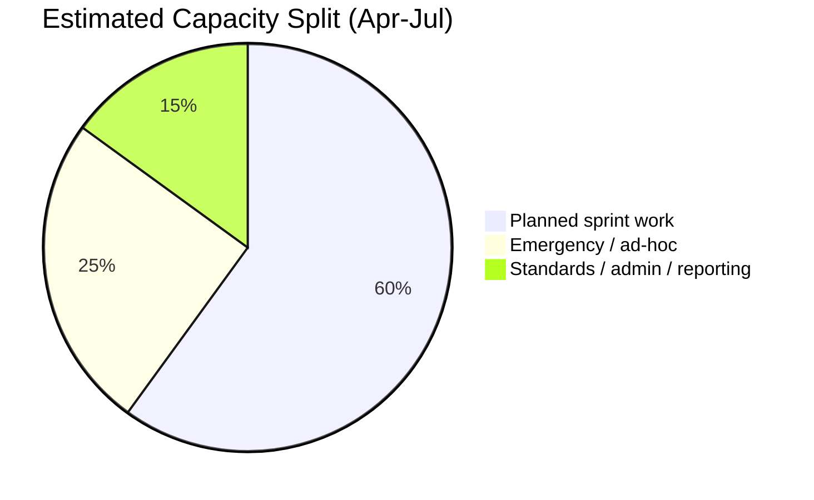

# Cross-Team Support & Emergency Delivery

AM Squad is the **go-to automation team** for emergency and cross-team requests. This work consistently pulls capacity from planned sprint commitments.

---

## Emergency projects delivered (Apr–Aug 2026)

| Project | Requestor | Timeline | Deliverable | Owner |
|---------|-----------|----------|-------------|-------|
| **Empower plan conversion** | Program team | Q2 2026 | Stage 5 regression framework + Jenkins smoke job | Swapnil |
| **Barcode SYN-443 perf** | SYN team | **1 week** | QC4 + Stage1 baselines (30/45/60 SPM) | Priti |
| **IDP server — auth & Pixie flow perf** | IDP team | Q2 2026 | IDP login resources, authentication, and Pixie flow performance test cases in Jenkins regression suite | Priti + Swapnil |
| **Jahia (Jia) proxy — server patch validation** | Platform team (Arun) | **1 week** (late Jul 2026) | Post-login banner/page perf baselines for Jahia proxy server patch — pre/post patch comparison | Priti + Swapnil |
| **Stage 5 smoke suite** | Release team | May 2026 | UE + IDP smoke TestNG suites | Swapnil |
| **Stage 2 smoke** | Release team | Q2 2026 | Smoke framework + Jenkins job | Swapnil |
| **QC4 cross-team validation** | Multiple | Ongoing | API + UI validation support | Sunil + team |

---

## Empower plan — detail

| Item | Status |
|------|--------|
| `STAGE1-Daily-Empower-Regression` Jenkins job | Running nightly (75 test methods) |
| Stage 5 smoke framework | Created and handed off |
| Stage 5 Jenkins job | Running (maintenance TBD by owning team) |

---

## Barcode SYN-443 — detail

Delivered full performance test cycle in one week:

- Postman collection setup (QC4 + Stage1 environments)
- JMeter scripts with certificate auth
- Jenkins job integration
- Execution reports with pass/fail at 30, 45, 60 submissions-per-minute
- Sign-off email draft prepared

KB: `programs/Performance Testing/barcode-syn-443/`

---

## IDP server — auth & Pixie flow perf (Q2 2026)

Separate from the Jahia proxy patch work below. Delivered during Q2 as part of the IDP performance track:

| Item | Detail |
|------|--------|
| Scope | IDP authentication flows + Pixie flow performance coverage |
| Scenarios | IDP login resources, auth server delay, forgot username/password |
| Integration | Added to Jenkins weekday regression suite (`AGSUP_ENDURANCE_THROUGHPUT`) |
| Owner | Priti Choudhary (execution), Swapnil Patil (framework/Jenkins wiring) |

---

## Jahia (Jia) proxy — server patch validation (1 week)

Joint requirement from **Arun** (platform team) to validate a **Jahia proxy server patch** — not the same as the Q2 IDP auth baselines above.

| Item | Detail |
|------|--------|
| Requestor | Arun (platform team — Arun, Mayank, Dhruv) |
| Timeline | **1 week** turnaround (late Jul 2026) |
| Scope | Post-login banner/dashboard page performance on stage1 — pre/post patch comparison |
| Deliverable | JMeter script + Taurus YAML for IDP login → post-login banner pages; BlazeMeter baselines |
| Status | Script built and baselines captured; stakeholder load profile confirmation pending |

KB: `programs/Performance Testing/IDPLogin/`

---

## Revolt code review support

- Cross-team automation PR reviews
- Framework consultation for teams adopting TestNG/Cucumber patterns
- Standards enforcement aligned with AM Squad conventions

---

## Impact on sprint capacity

Emergency intake is valued and welcomed — but it needs to be **visible in planning**, not only surfaced at sprint end.

---

## Why this matters for leadership

Michael Blake's team sees V2/V3 regression numbers. They do **not** see:

- 1-week barcode turnaround
- Empower framework from scratch
- IDP auth + Pixie flow perf baselines (Q2)
- Jahia proxy server patch validation (1 week, Arun)
- Revolt review hours
- qTest/SharePoint migration weeks

This pack makes that invisible work visible.
