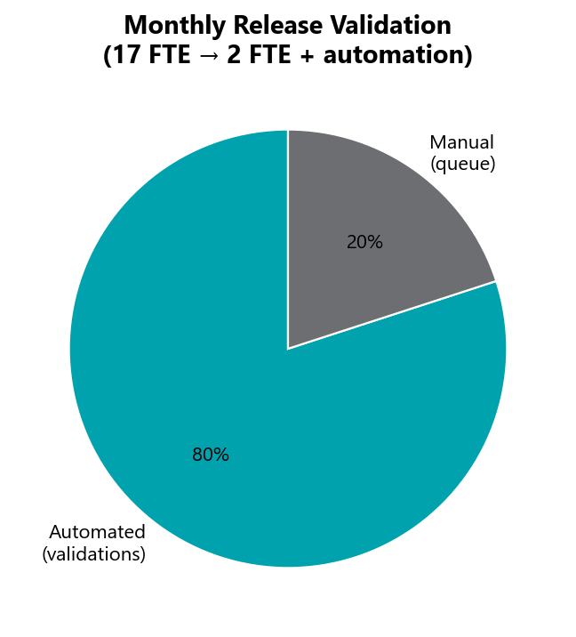

# Standards & Framework Design

**Owner:** Swapnil Patil (architecture), enforced across AM Squad and broader QA org

---

## Work that doesn't show in GitLab MR counts

These investments were made in late 2025 / Q1 2026 and continue to pay dividends. They are **not** captured in monthly regression test counts but are foundational to how the department operates.

---

## qTest master suite design

| Deliverable | Detail |
|-------------|--------|
| Problem | qTest was a **dump** — no structure, no enforcement |
| Solution | Extracted all cases → designed **master suite plan** with folder hierarchy |
| Migration | Moved to SharePoint with enforcement playbook |
| Enforcement | Q1 2026: weekly reports to scrum masters for adoption tracking |
| Impact | All QAs now follow consistent suite/folder conventions |

---

## Automation Bug Lifecycle standard

Full playbook published in this KB:

| Artifact | Location |
|----------|----------|
| Standard document | `automation-bug-lifecycle/automation-bug-lifecycle-standard.md` |
| Workflow | `automation-bug-lifecycle/WORKFLOW.md` |
| Playbook (DOCX) | `automation-bug-lifecycle/deliverables/` |
| Training deck (PPTX) | `automation-bug-lifecycle/deliverables/` |

**Process:** Regression failure → evidence folder → triage decision tree → JIRA bug → leadership-approved email → Teams → GitLab change-set investigation → resolution.

---

## API test framework (Unite MSC)

Designed from scratch by Swapnil Patil:

- Canonical project structure (`mobile/mobile1`, `mobile/mobile2`, `enrollment`)
- Shared auth token client (OKD, NMD, IDP, CSR, PIN paths)
- Dynamic SQL credential loading per branding
- HTML reporting with module + master suites
- POJO/fixture patterns for contribution, activity, banks
- EUT migration tooling for legacy → TestNG conversion

---

## Performance testing standards

Established by Priti Choudhary:

- Folder structure: `performance/{platform|mobile|unite}/{area}/jmeter/`
- Taurus remote YAML convention with environment properties
- Jenkins job parameterization (concurrency, throughput, duration, ramp)
- BlazeMeter integration and report archiving
- Definition of Done checklist for new perf scenarios

---

## Revolt group — cross-team code review

Swapnil Patil participates in the **Revolt** review group:

- Reviews automation PRs from other teams
- Provides framework guidance and coding standards feedback
- Acts as quality gate before merge to shared repos

*Review count not tracked in GitLab MR exports — available from GitLab dashboard on request.*

---

## Monthly release automation

| Before | After |
|--------|-------|
| **17 resources** for 1-week release validation | **2 resources** + automation |
| ~20% manual queue | **~80% automated** validations |

This is the single largest ROI deliverable — not reflected in sprint MR velocity but saves ~15 FTE-weeks per monthly release.

