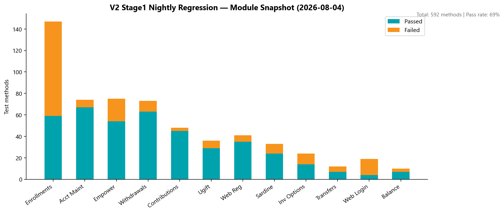

# V2 Legacy UI Automation

**Owner:** Venkatesh Mallela (primary), Sunil Godiyal (CSR modules)  
**Repository:** [unite-test-automation](https://gitlab.com/ascensus-gs/products/depot/qa-automation/automation)  
**Nightly job:** `STAGE1-Daily-Unite-Prime-Regression` (Jenkins, Mon–Fri 12:00 AM EST)

---

## What V2 is

V2 is the **legacy Cucumber + Ant + TestNG** UI automation stack for Unite/Prime front-office flows — login, enrollment, contributions, withdrawals, CSR maintenance, and plan-specific suites (Empower, Sardine).

---

## Nightly regression snapshot — 2026-08-04

| Module | Methods | Passed | Failed | Pass % |
|--------|--------:|-------:|-------:|-------:|
| Enrollments | 147 | 59 | 88 | 40% |
| Account / Profile Maintenance | 74 | 67 | 7 | 91% |
| Empower Plan | 75 | 54 | 21 | 72% |
| Withdrawals | 73 | 63 | 10 | 86% |
| Contributions | 48 | 45 | 3 | 94% |
| Ugift | 36 | 29 | 7 | 81% |
| Legacy Web Registration | 41 | 35 | 6 | 85% |
| Stage1 Sardine | 33 | 24 | 9 | 73% |
| Investment Options | 24 | 14 | 10 | 58% |
| Legacy Web Login | 19 | 4 | 15 | 21% |
| Transfers | 12 | 7 | 5 | 58% |
| Account Balance Page | 10 | 7 | 3 | 70% |
| **TOTAL** | **592** | **408** | **184** | **69%** |

> Enrollments and Legacy Web Login failures are under active triage (app/env vs automation). CSR maintenance modules are consistently **>85% pass**.

---

## What we added (Apr–Jul 2026)

V2 MR count: **42 merges** to `automation` repo. Highlights:

| Area | Stories / MRs | Team |
|------|--------------|------|
| CSR Fee Entry | QA-958 | Sunil |
| CSR Single/Multiple Contribution | QA-912, QA-941 | Sunil |
| Authorize Agent | QA-803 | Sunil |
| Security Questions | QA-179 | Sunil |
| Payroll Deduction | QA-729 | Sunil |
| Member Beneficiaries | QA-594 | Sunil |
| Member Transfer | QA-494 | Sunil |
| Member Personal Information | QA-555 | Sunil |
| Ugift multi-plan (ABLE) | QA-1002/1003 | Venkatesh |
| GSP Enrollment / NVU prefill | QA-882/884/904/906 | Venkatesh |
| CSR/Member Ugift Contribution | QA-626/627 | Venkatesh |
| ADC Direct plan | QA-540/541 | Venkatesh |
| Future/Custom Exchange | QA-589/592/607/628 | Venkatesh |
| V2 regression suite curation | QA-1275 | Venkatesh |
| Non-IDP plan updates | QA-742/758/580 | Venkatesh |

---

## Suite curation (why counts may go down)

QA-1275 **"Update and Remove V2 Regression"** (Jul 2026) intentionally removed obsolete or duplicate scenarios. Net suite size reflects **quality over quantity** — leadership should watch **module coverage breadth**, not just total count.

---

## Additional V2 jobs

| Job | Schedule | Purpose |
|-----|----------|---------|
| `STAGE1-Daily-Empower-Regression` | Mon–Fri 2 AM | Empower plan conversion suite (75 methods) |
| `STAGE5-Unite-Prime-SmokeTest` | On-demand | Stage 5 smoke (Swapnil — QA-773) |
| `STAGE1-Unite-Prime-Regression-SmokeTest` | On-demand | Fast smoke subset |

---

## Evidence

- HTML reports: `programs/leadership-updates-legacy/AMSquad_OverallUpdate/V2 reports - 08042026/`
- Jenkins config: `evidence/jenkins/stage1-daily-unite-prime-regression.txt`
