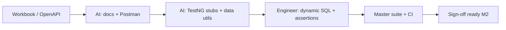

# AI Acceleration Portfolio — AM Squad

**One-page summary for leadership** · **Period:** 2025 – Aug 2026 · **Owner:** Swapnil Patil

---

## Why we invested in AI agents

MSC migration proved the model: **AI generates boilerplate; engineers refine dynamic data, assertions, and suite wiring.** Result: **~50% schedule compression** on Mobile 2. We replicated the pattern across bug triage, leadership reporting, and coverage intelligence.

---

## Agent & automation inventory

| # | Name / capability | Where it lives | What it does | Value delivered |
|---|-------------------|----------------|--------------|-----------------|
| 1 | **MSC migration agents** | Cursor + `api-test-automation` program KB | Postman collections, endpoint docs, data utils, TestNG class stubs from OpenAPI/workbook | MSC M2 **25/25** in ~half original ETA |
| 2 | **Automation Bug Lifecycle skill** | `automation-bug-lifecycle/cursor-kit/SKILL.md` | Triage → evidence folder → Prompt H (JIRA + email + Teams) → GitLab change-set investigation | Hours per defect vs days of ad hoc reporting |
| 3 | **Cursor Prompt library** | `qa-knowledge-base/00_SYSTEM/PROMPTS.md` | Prompts H, F2, G, I, J — bug reports, leadership updates, RCA, module doc refresh | Repeatable outputs; Confluence/Jira-ready |
| 4 | **GitLab Project Manager (change-set)** | External tool + `automation-bug-lifecycle/prompts/03-gitlab-change-set.md` | Who merged what in monolith window for regression failures | Root-cause attribution without manual git archaeology |
| 5 | **Leadership chart generator** | `programs/leadership-updates/tools/generate_leadership_charts.py` | MR velocity, area split, MSC coverage, release impact PNGs | Regenerable deck charts from CSV/JSON |
| 6 | **GitLab MR analyzer** | `programs/leadership-updates/tools/analyze_gitlab_mrs.py` | Parses MR exports → `team-mr-summary.json` | **116 MR** breakdown by author/month/repo — auditable |
| 7 | **Bug lifecycle deliverables generator** | `automation-bug-lifecycle/tools/generate_deliverables.py` | Branded DOCX + PPTX for automation bug standard | Leadership-ready playbook without manual formatting |
| 8 | **Coverage intelligence collector** | `programs/government-savings-assessment/coverage-intelligence/` | Python assessment: Jira + qTest + repo + CI reconciliation | Foundation for dynamic monthly dashboard |
| 9 | **Leadership deliverables generator** | `programs/leadership-updates/tools/generate_leadership_deliverables.py` | VP briefing DOCX + PPTX from this pack | This August 2026 pack — reproducible monthly |
| 10 | **MCP connectors** | Cursor `mcp.json` — Jira, GitLab, qTest, Slack | Live validation of stories, MRs, test inventory | Jira ✅ · GitLab ⚠️ cert · qTest ⚠️ — see [09-mcp-validation](./09-mcp-validation-and-data-confidence.md) |

---

## MSC AI workflow (proven pattern)

**Human-owned (not delegated to AI):** destructive test routing, branding/plan matrix (OKD non-IDP · NYD/NMD IDP), pipeline switches, Stage1 data fixtures.

---

## Measured impact

| Metric | Before AI-assisted workflow | After |
|--------|----------------------------|-------|
| MSC Mobile 2 schedule | Behind original ETA | **~50% faster** |
| Bug report cycle | Ad hoc Word/email | **Standardized Prompt H** + skill |
| Leadership pack assembly | Manual copy/paste | **Scripted charts + DOCX/PPTX generator** |
| MR evidence for VP | Manual spreadsheet | **`analyze_gitlab_mrs.py` → JSON/CSV** |

---

## Q3 AI roadmap

| Initiative | Goal |
|------------|------|
| **Monthly dashboard agent** | Auto-pull Jira + GitLab + Jenkins → leadership JSON snapshot |
| **qTest inventory sync** | Module counts by platform for coverage register |
| **Enrollment API agent** | Scaffold from OpenAPI → TestNG (MSC enrollment pilot) |
| **MCP hardening** | Fix GitLab TLS + qTest connectivity for live validation |

---

## Leadership takeaway

AI is not replacing QA engineers — it **removes boilerplate** so the squad spends time on **framework architecture, dynamic test data, pipeline design, and cross-team rescue**. That is why MSC finished early and why we can propose a **dynamic monthly dashboard** without adding headcount.
