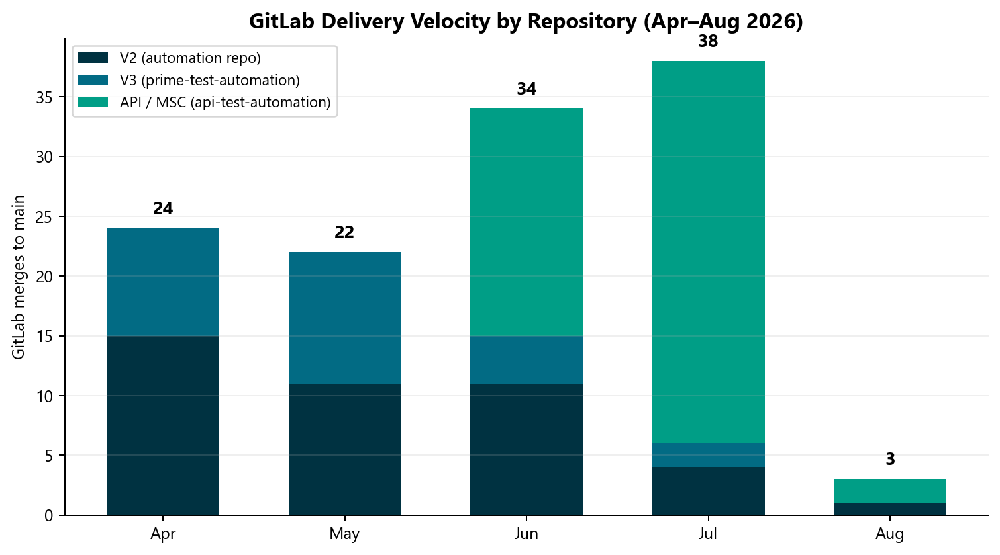

# AM Squad Leadership Update — August 2026

**Prepared for:** Michael Blake, Dhanashree, VP/Director audience  

**Prepared by:** Swapnil Patil / QA Automation (AM Squad)  

**Reporting period:** April 1 – August 4, 2026  

**Point of contact:** Swapnil Patil

---

## Leadership deliverables (start here for VP)

| Format | Document | Use when |

|--------|----------|----------|

| **One-pager** | [VP One-Pager](./05-vp-one-pager.md) | Michael Blake — 2-minute read |

| **Presentation (classic — updated)** | [AM-Squad-Leadership-Update-Aug2026.pptx](./deliverables/AM-Squad-Leadership-Update-Aug2026.pptx) | Full deck — modern BI design (chart + insight layout) |
| **Executive glimpse** | [AM-Squad-Leadership-Executive-Glimpse-Aug2026.pptx](./deliverables/AM-Squad-Leadership-Executive-Glimpse-Aug2026.pptx) | **Share with leadership** — chart + insight per slide |
| **Detailed modern** | [AM-Squad-Leadership-Detailed-Modern-Aug2026.pptx](./deliverables/AM-Squad-Leadership-Detailed-Modern-Aug2026.pptx) | Full portfolio — BI dashboard design |

| **Briefing doc (updated)** | [AM-Squad-Leadership-Briefing-Aug2026.docx](./deliverables/AM-Squad-Leadership-Briefing-Aug2026.docx) | Email / Confluence — KPI grid, chart panels, data confidence section |

| **Value + roadmap** | [Value, Roadmap & ETA](./06-value-roadmap-and-eta.md) | "What value did we add?" |

| **AI portfolio** | [AI Acceleration Portfolio](./07-ai-acceleration-portfolio.md) | AI agents one-pager |

| **Dashboard plan** | [Monthly Dashboard Operating Model](./08-monthly-dashboard-operating-model.md) | How to maintain this monthly |

| **Data confidence** | [MCP Validation Report](./09-mcp-validation-and-data-confidence.md) | Number validation audit |
| **Leadership FAQ** | [Data Confidence & FAQ](./10-data-confidence-and-leadership-faq.md) | If VP asks "are these numbers real?" |

Regenerate deck + doc: `python programs/leadership-updates/tools/generate_leadership_deliverables.py`

---

## Full pack index

| # | Document | What it covers |

|---|----------|----------------|

| 1 | [Executive Summary](./01-executive-summary.md) | One-page VP view — headline numbers, wins, asks |

| 2 | [V2 Legacy UI Automation](./02-area-deep-dives/v2-ui-automation.md) | Nightly Jenkins regression, CSR modules, suite growth |

| 3 | [V3 Universal Platform](./02-area-deep-dives/v3-universal-platform.md) | GitLab nightly, IDP/entity enrollment, TestNG suites |

| 4 | [API / Unite MSC](./02-area-deep-dives/api-unite-msc.md) | Framework migration, M1/M2 endpoints, AI-accelerated delivery |

| 5 | [Performance Testing](./02-area-deep-dives/performance-testing.md) | IDP, legacy login, MSC, barcode — Jenkins suites |

| 6 | [Pipeline & CI/CD](./02-area-deep-dives/pipeline-cicd.md) | Hub pipeline, enrollment/metadata, GHA/Nexus |

| 7 | [Standards & Frameworks](./02-area-deep-dives/standards-and-frameworks.md) | qTest, bug lifecycle, perf DoD, API framework design |

| 8 | [Cross-Team Support](./02-area-deep-dives/cross-team-support.md) | Empower, Stage 5, barcode, JEA proxy, Revolt reviews |

| 9 | [Team Contributions](./03-team-contributions.md) | Per-person MR delivery, roles, monthly breakdown |

| 10 | [Leadership Asks](./04-leadership-asks.md) | Roadmap clarity + admin capacity |

| 11 | [Email Draft](./email-draft-to-dhanashree.md) | Ready-to-send summary for Dhanashree |

---

## Charts (visual summary)

| Chart | File |

|-------|------|

| GitLab MRs by month | [01-gitlab-mrs-by-month.png](./assets/charts/01-gitlab-mrs-by-month.png) |

| MRs by automation area | [02-gitlab-mrs-by-area.png](./assets/charts/02-gitlab-mrs-by-area.png) |

| MRs by team member | [03-gitlab-mrs-by-author.png](./assets/charts/03-gitlab-mrs-by-author.png) |

| V2 regression module snapshot | [04-v2-regression-by-module.png](./assets/charts/04-v2-regression-by-module.png) |

| Unite MSC coverage progress | [05-unite-msc-coverage.png](./assets/charts/05-unite-msc-coverage.png) |

| Work allocation index | [06-work-allocation-index.png](./assets/charts/06-work-allocation-index.png) |

| Release automation impact | [07-release-automation-impact.png](./assets/charts/07-release-automation-impact.png) |

Regenerate: `python programs/leadership-updates/tools/generate_leadership_charts.py`

---

## Data files

| File | Description |

|------|-------------|

| [data/monthly-delivery-metrics.csv](./data/monthly-delivery-metrics.csv) | Month-by-month MR and area breakdown |

| [data/regression-snapshot-2026-08-04.csv](./data/regression-snapshot-2026-08-04.csv) | V2 module pass/fail counts (Stage1 nightly) |

| [data/team-mr-summary.json](./data/team-mr-summary.json) | Machine-readable GitLab MR analysis |

| [evidence/gitlab/](./evidence/gitlab/) | GitLab MR exports (source) |

---

## Evidence index

Full HTML regression reports, Jenkins console logs, and Perf job outputs:

[Legacy evidence folder index](./reference/legacy-evidence-index.md)

---

## Recommended follow-up

Schedule a 30-minute walkthrough with Swapnil Patil — framework design, qTest migration, and pipeline wiring do not fit cleanly into MR counts alone.

