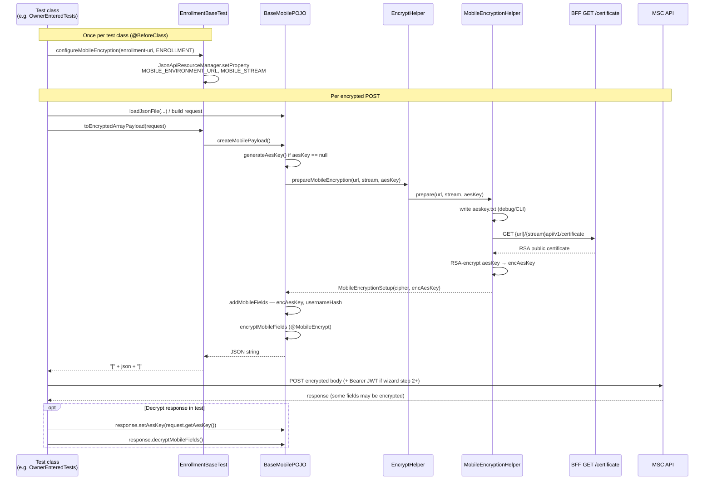
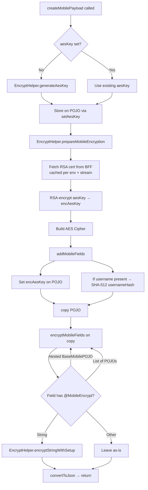
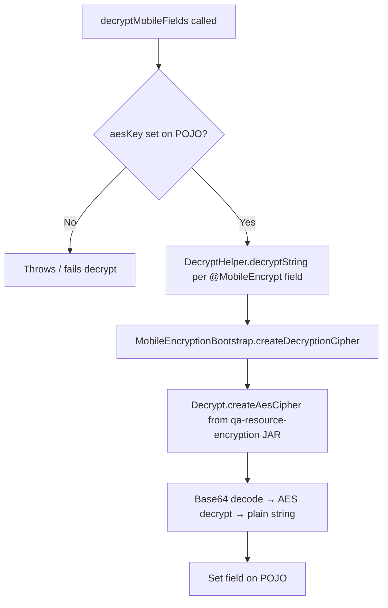
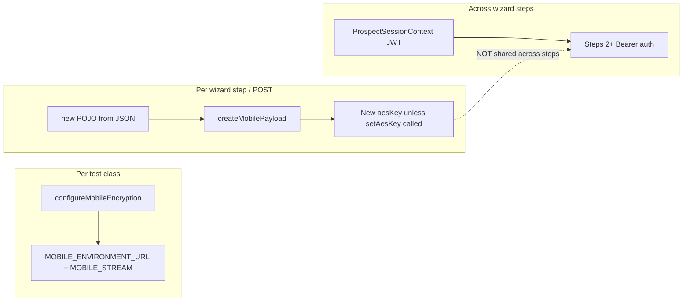
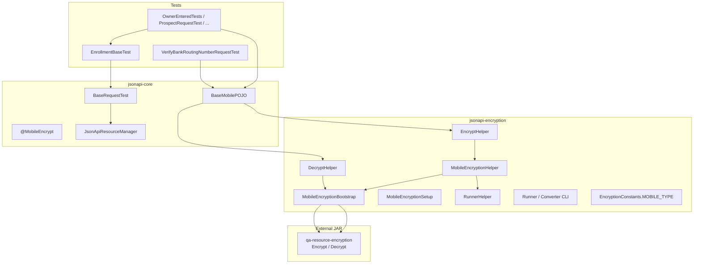
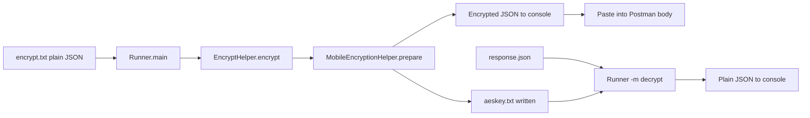

# Mobile AES Encryption — Framework Flow

How the **`api-test-automation`** framework generates, wraps, sends, and reuses AES keys for mobile MSC APIs (enrollment, mobile1, mobile2). Use this when writing or reviewing encrypted POST tests, debugging decrypt failures, or onboarding to `@MobileEncrypt` POJOs.

**Related docs**

| Doc | Scope |
|-----|--------|
| [Enrollment encryption (Postman / CLI)](../msc-enrollment/docs/04-encryption-guide.md) | Manual E2E, field lists, `EncryptHelper` CLI flags |
| [Enrollment wizard guide](../../../msc-enrollment/docs/12-automation-team-guide.md) | Step-by-step automation for enrollment |
| `api-test-automation/mobile/enrollment/ENROLLMENT-WIZARD-GUIDE.md` | In-repo wizard conventions |

---

## Two keys — do not confuse them

| Name | Where it lives | Format | Purpose |
|------|----------------|--------|---------|
| **`aesKey`** | Test-side only — `BaseMobilePOJO.aesKey` (not serialized to JSON) | `{base64AesKey};{base64Iv}` | Encrypt request fields; decrypt response fields in tests |
| **`encAesKey`** | Sent in the API JSON body | Base64(RSA-encrypted `aesKey` string) | Server decrypts with its private key to obtain the session AES key |

```text
  Test POJO                         API JSON body
  ┌─────────────────┐              ┌──────────────────────────┐
  │ aesKey (plain)  │──RSA wrap──► │ encAesKey (in payload)   │
  │ key;iv          │              │ + encrypted PII fields   │
  └─────────────────┘              └──────────────────────────┘
         │
         └── kept via getAesKey() for response decrypt
```

---

## End-to-end sequence (TestNG)



---

## `createMobilePayload()` flowchart



---

## AES key generation

**Class:** `MobileEncryptionBootstrap.generateAesKeyWithIv()`  
**Called via:** `EncryptHelper.generateAesKey()` → `BaseMobilePOJO.generateAesKey()`

| Step | Detail |
|------|--------|
| Algorithm | AES-256 |
| IV | 16 random bytes |
| Output format | `Base64(keyBytes) + ";" + Base64(ivBytes)` |

**Manual override** (reuse same key across multiple encrypt calls in one test):

```java
request.setAesKey("existingBase64Key;existingBase64Iv");
request.createMobilePayload(); // uses provided key, does not regenerate
```

---

## Certificate fetch and RSA wrap

**Class:** `MobileEncryptionHelper.prepare()`

```text
GET {MOBILE_ENVIRONMENT_URL}/{MOBILE_STREAM}api/v1/certificate
     ↓
_embedded.item.certificate  (RSA public key PEM)
     ↓
RSA encrypt plain aesKey string (UTF-8 bytes)
     ↓
Base64 → encAesKey (sent in JSON)
```

| `MOBILE_STREAM` | API path segment | Example cert URL (Stage1) |
|-----------------|------------------|---------------------------|
| `ENROLLMENT` | `enrollmentapi/v1/` | `https://unite-bff-cloud.stage1.unite529.com/enrollmentapi/v1/certificate` |
| `MOBILE1` | `mobile1api/v1/` | `.../mobile1api/v1/certificate` |
| `MOBILE2` | `mobile2api/v1/` | `.../mobile2api/v1/certificate` |

Certificates are **cached in memory** per `{environmentUrl}:{stream}` for the JVM run.

---

## Test setup — configure once per class

**Enrollment example** (`EnrollmentBaseTest.setupBeforeAll`):

```java
configureMobileEncryption(getProperty("enrollment-uri"), MOBILE_TYPE.ENROLLMENT);
```

**`BaseRequestTest.configureMobileEncryption()`** stores:

| Property | Example |
|----------|---------|
| `MOBILE_ENVIRONMENT_URL` | `https://unite-bff-cloud.stage1.unite529.com` |
| `MOBILE_STREAM` | `ENROLLMENT` |

`BaseMobilePOJO.createMobilePayload()` reads these from `JsonApiResourceManager` at runtime.

---

## Building the request body

```text
EnrollmentBaseTest.toEncryptedArrayPayload(request)
    → "[" + request.createMobilePayload() + "]"
```

Enrollment BFF expects encrypted wizard POSTs as a **one-element JSON array**.

### Fields added automatically

| Field | When | How |
|-------|------|-----|
| `encAesKey` | Always (mobile POST) | RSA-wrapped AES key from setup |
| `usernameHash` | When plain `username` is set on POJO | `SHA-512(username)` → Base64 |

`username` is typically `@JsonIgnore` on the POJO — used only to compute the hash, not sent in JSON.

### Fields encrypted

Any field annotated with **`@MobileEncrypt`** (String, or `List<String>`). Encryption walks nested `BaseMobilePOJO` objects recursively.

**Enrollment POJOs with `@MobileEncrypt`:** `ProspectSectionPOJO`, `OwnerPOJO`, `BankPOJO`, `BeneficiaryPOJO`, `BankVerifyRoutingRequestPOJO.routingNumber`, `BankVerifyRoutingNumberResponsePOJO.routingNumber`, etc.

---

## Decryption flow



**Skip during decrypt:** `encAesKey`, `encryptedAesKey`, numeric strings, literal `"null"`.

### Request → response reuse (enrollment example)

`VerifyBankRoutingNumberRequestTest`:

```java
HttpRestApiClientResponse response = client.invokeRestApi(
        RestType.POST, VERIFY_ROUTING_PATH, null,
        toEncryptedArrayPayload(request), BodyType.JSON, null);

BankVerifyRoutingNumberResponsePOJO responseBody =
        response.convertToListPOJO(BankVerifyRoutingNumberResponsePOJO.class).get(0);

responseBody.setAesKey(request.getAesKey());
responseBody.decryptMobileFields();
assertEquals(responseBody.getRoutingNumber(), routingNumber);
```

After `toEncryptedArrayPayload(request)`, **`request.getAesKey()`** holds the plain key used for that request.

---

## What is reused vs regenerated



| Artifact | Reused across wizard? | Notes |
|----------|----------------------|-------|
| Prospect JWT | **Yes** — `ProspectSessionContext` | Set in `ProspectRequestTest` |
| `aesKey` | **No** — new key per `createMobilePayload()` | Unless you call `setAesKey()` first |
| RSA certificate | **Yes** — JVM cache | Per env + stream |
| `aeskey.txt` | Side-effect file | Written on each `prepare()`; used by CLI decrypt |

---

## Class map (by layer)



| Class | Module | Responsibility |
|-------|--------|----------------|
| `BaseRequestTest` | jsonapi-core | `configureMobileEncryption()` — env properties |
| `EnrollmentBaseTest` | mobile/enrollment | Calls configure + `toEncryptedArrayPayload()` |
| `BaseMobilePOJO` | jsonapi-core | `aesKey` field; `createMobilePayload()` / `decryptMobileFields()` |
| `@MobileEncrypt` | jsonapi-encryption | Marks encryptable String fields |
| `EncryptHelper` | jsonapi-encryption | Public API: generate, prepare, encrypt string |
| `MobileEncryptionHelper` | jsonapi-encryption | Cert fetch, RSA wrap, JSON field encryption |
| `MobileEncryptionBootstrap` | jsonapi-encryption | AES key+IV generation, cipher factory |
| `MobileEncryptionSetup` | jsonapi-encryption | Holds `Cipher` + `encryptedAesKey` for one request |
| `DecryptHelper` | jsonapi-encryption | `decryptString()`, JSON decrypt |
| `Encrypt` / `Decrypt` | qa-resource-encryption | Low-level `createAesCipher`, `createRsaCipher`, Base64 |
| `RunnerHelper` | jsonapi-encryption | Read/write `aeskey.txt`, `encrypt.txt`, `decrypt.txt` |
| `Runner` | jsonapi-encryption | CLI encrypt/decrypt (`-m encrypt|decrypt`) |
| `EncryptionConstants` | jsonapi-encryption | `MOBILE_TYPE`, environment URL resolution |

---

## CLI path (Postman / manual)

Same crypto stack, invoked outside TestNG:

```powershell
cd C:\Workspace\GitLab\api-test-automation\jsonapi\jsonapi-encryption
mvn package -DskipTests

java -cp target/jsonapi-encryption-*.jar core.encryption.runner.Runner `
  -m encrypt -e stage -s enrollment -f encrypt.txt
```



| CLI flag | Encrypt | Decrypt |
|----------|---------|---------|
| `-m` | `encrypt` | `decrypt` |
| `-e` | `stage`, `qc4`, `dev`, `local8080`, `local8200` | — |
| `-s` | `enrollment`, `mobile1`, `mobile2` | — |
| `-f` | Input file | Input file |
| `-a` | Optional AES key (auto-generated if omitted) | AES key (default: `aeskey.txt`) |

See [Enrollment encryption guide](../msc-enrollment/docs/04-encryption-guide.md) for Postman workflow and field lists.

---

## Enrollment wizard — encryption touchpoints

```text
ProspectRequestTest          → toEncryptedArrayPayload (new aesKey)
EnrollmentContentRequestTest → GET only (no encryption)
OwnerEnteredTests            → toEncryptedArrayPayload (new aesKey)
BankEnteredRequestTests      → toEncryptedArrayPayload (new aesKey)
BeneficiaryEnteredTests      → toEncryptedArrayPayload (new aesKey)
VerifyBankRoutingNumberRequestTest → encrypt + decrypt response with request.getAesKey()
AllocationsEnteredRequestTests → toEncryptedArrayPayload (new aesKey)
```

---

## Troubleshooting

| Symptom | Likely cause | Check |
|---------|--------------|-------|
| `Failed to add mobile fields` / cert error | Wrong `enrollment-uri` or stream | `configureMobileEncryption` URL matches target env |
| Decrypt returns garbage | Wrong `aesKey` on response POJO | `setAesKey(request.getAesKey())` from **same** request |
| `Invalid AES key` | Malformed key string | Must be `base64Key;base64Iv` |
| Padding exception in Postman | Double encryption or stale cipher text | Encrypt from plain JSON only; regenerate |
| `usernameHash` missing | `username` not set on POJO before encrypt | `request.setUsername(...)` before `createMobilePayload()` |
| `aeskey.txt` out of sync | Multiple parallel tests writing same file | File is debug aid; tests use in-memory `getAesKey()` |

---

## Source file index (`api-test-automation`)

| Path | Role |
|------|------|
| `jsonapi/jsonapi-core/src/main/java/core/pojo/common/BaseMobilePOJO.java` | Core encrypt/decrypt POJO logic |
| `jsonapi/jsonapi-core/src/main/java/core/test/BaseRequestTest.java` | `configureMobileEncryption()` |
| `jsonapi/jsonapi-encryption/src/main/java/core/encryption/helper/EncryptHelper.java` | Encryption facade |
| `jsonapi/jsonapi-encryption/src/main/java/core/encryption/helper/MobileEncryptionHelper.java` | Cert + RSA + field encrypt |
| `jsonapi/jsonapi-encryption/src/main/java/core/encryption/helper/MobileEncryptionBootstrap.java` | Key generation |
| `jsonapi/jsonapi-encryption/src/main/java/core/encryption/helper/DecryptHelper.java` | Decryption |
| `jsonapi/jsonapi-encryption/src/main/java/core/encryption/runner/Runner.java` | CLI entry point |
| `jsonapi/jsonapi-encryption/docs/Readme.txt` | JAR build and CLI notes |
| `mobile/enrollment/src/test/java/EnrollmentBaseTest.java` | `toEncryptedArrayPayload()` |
| `mobile/enrollment/src/test/java/VerifyBankRoutingNumberRequestTest.java` | Request → response aesKey reuse |
| `jsonapi/jsonapi-core/src/test/java/core/pojo/common/BaseMobilePOJOTest.java` | Unit tests for `BaseMobilePOJO` |

---

## Maintenance

- Update this doc when `BaseMobilePOJO`, `MobileEncryptionHelper`, or enrollment encrypt patterns change.
- Keep [msc-enrollment encryption guide](../msc-enrollment/docs/04-encryption-guide.md) aligned for Postman/CLI; link here for Java/TestNG internals.
