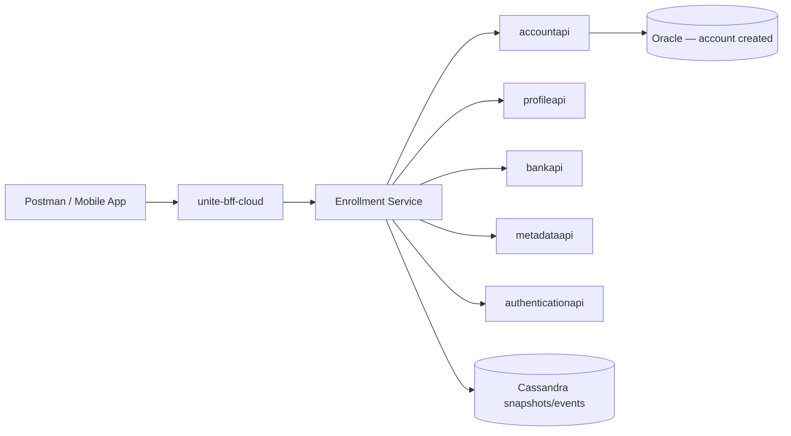

# MSC Enrollment — Overview

## What this is

MSC Enrollment is the **mobile 529 account enrollment API** exposed at:

```
{host}/enrollmentapi/v1/*
```

Default Stage1 host: `https://unite-bff-cloud.stage1.unite529.com`

It is **not** the same as:

| System | API | Notes |
|--------|-----|-------|
| Universal Platform (web) | `aws-account-web` JSON:API | Already automated in `jsonapi-aws-accountweb` |
| Legacy JSP enrollment | Browser forms | Out of scope |
| **MSC Enrollment (this doc)** | `enrollmentapi/v1` | Event-driven wizard; mobile app flow |

## Architecture



## Event-driven model

Each wizard step is a **POST** to:

```
POST /enrollmentapi/v1/enrollments/{topic}/{event}
```

- `topic` = `enrollment` (first account) or `subsequentenrollment` (add account to existing member)
- `event` = `owner-entered`, `beneficiary-entered`, `review-confirm-entered`, etc.

The service chains events using:

| Field | Purpose |
|-------|---------|
| `correlationId` | Ties all events in one enrollment session |
| `eventId` | Unique per event |
| `seqNum` | Sequence number (incremented from parent) |
| `parent` | Reference to prior event (`correlationId`, `eventId`, `seqNum`) |

For simple Postman runs, you can skip individual wizard steps and send the **full aggregate** directly to `review-confirm-entered`. The service re-runs all validations at submit time.

## Authentication model

| Phase | Token | How obtained |
|-------|-------|--------------|
| Create prospect | None | `POST /enrollments/prospects` |
| Wizard steps 06–12 | **Prospect JWT** (`ENROLL_PROSPECT`) | Returned in `jwtToken` field from create-prospect |
| After submit | **Member JWT** | Returned in `x-enc-jwttoken` response header |

**Important:** A logged-in **member JWT blocks** enrollment wizard calls (401 on `enrollment` topic).

## Encryption model (summary)

| Environment | GET endpoints | POST endpoints |
|-------------|---------------|----------------|
| Local/dev | Plain JSON OK | May work plain |
| Stage1 / QC4 / Prod | Plain JSON OK | **Must encrypt PII fields** |

Flow:

1. `GET /certificate` → RSA public key (per environment)
2. Client generates AES-256 key + IV
3. RSA-wrap AES key → `encAesKey` on request root
4. AES-CBC encrypt PII fields (SSN, names, DOB, addresses, bank, password, email)
5. `usernameHash` = Base64(SHA-512(username)) — **not** AES encrypted
6. `prospect.plan` stays **plaintext**

See [04-encryption-guide.md](04-encryption-guide.md) for step-by-step instructions.

## What happens at review-confirm-entered

1. Validates prospect, owner, address, beneficiary, bank, allocations
2. Generates account number
3. Calls `accountapi/v1/accounts/create` (creates login, member, owner, bene, bank, allocations)
4. Persists Cassandra enrollment snapshot
5. Returns member JWT with `uii_member_id` entitlement

This is the **only step that creates the account** in Oracle.

## Endpoint count

| Category | Count | Examples |
|----------|-------|----------|
| Health / infra | 6 | `/health/liveness`, `/health/readiness` |
| Reference data (GET) | 5 | `ping`, `certificate`, `usstates`, `plans` |
| Auth | 1 | `oauth/token` |
| Prospect / start | 2 | `prospects`, `enrollmentstarted` |
| Wizard events (POST) | 12 event types | `owner-entered` … `review-confirm-entered` |
| Helpers | 3 | `verify/routingnumber`, `subsequentenrollment/banks`, `enrollmentallocationfunds/get` |
| Partner | 2 | `enrollments/submit` (Vanguard), `upromiseaccount` |

**Core E2E path uses 13 requests** (see [03-workflow-and-sequence.md](03-workflow-and-sequence.md)).

## Test scope for QA automation

| In scope | Out of scope (for now) |
|----------|------------------------|
| First enrollment happy path (hawaii / Stage1) | Subsequent enrollment |
| Response assertions (status, errors, JWT) | Mid-flow SQL checks |
| Post-submit account existence SQL | Vanguard partner submit |
| Unique test data generation | QC4 until Stage1 is stable |
