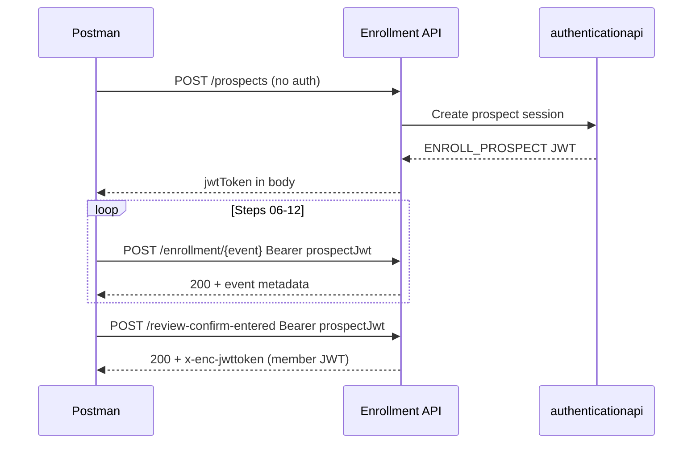

# Workflow & Sequence

## Full E2E sequence (13 steps)

This is the production-like flow. Steps marked *(optional)* can be skipped; `review-confirm-entered` re-validates everything.

```
Step  Env var / output captured
────  ─────────────────────────────────────────────────────────
 00   GET  /certificate                    → (EncryptHelper uses internally)
 01   GET  /ping                           → smoke check
 02   GET  /usstates                       → reference data
 03   GET  /plans                          → list plans
 04   GET  /plans/{planId}                  → capture enrollment.fundId (Postman); API: SQL lookup — docs/11-allocation-fund-sql.md
 05   POST /enrollments/prospects           → enrollment.prospectJwt
 06   POST .../owner-entered                → event metadata
 07   POST .../owner-address-entered        → event metadata
 08   POST .../beneficiary-entered          → event metadata
 09   POST /verify/routingnumber  (opt)     → bank name confirmation
 10   POST .../bank-entered                 → event metadata
 11   POST .../recurring-contribution-entered (opt) → skip with skipped:true
 12   POST .../allocations-entered         → event metadata
 13   POST .../review-confirm-entered      → accountNumber, member JWT header
```

## Dinesh's 10-step collection (simplified)

The original Postman collection in this folder had 10 requests. Mapping to full flow:

| Dinesh # | Full # | Endpoint | Notes |
|----------|--------|----------|-------|
| 01 | 01 | ping | Same |
| 02 | 03 | GET plans | Skipped usstates |
| 03 | 04 | GET plan by ID | Captures fundId (Postman); API uses SQL instead |
| 04 | 05 | POST prospects | Missing certificate/encryption |
| 05 | 06 | owner-entered | |
| 06 | 08 | beneficiary-entered | Skipped owner-address |
| 07 | 10 | bank-entered | |
| 08 | 12 | allocations-entered | |
| 09 | 09 | verify routing | Optional |
| 10 | 13 | review-confirm-entered | |

**Gaps in original collection:** certificate, usstates, owner-address-entered, recurring-contribution-entered.

## What each wizard step does (and why)

| Step | What it stores | Can skip? | Why it exists |
|------|----------------|-----------|---------------|
| **05 prospects** | Prospect session + partial snapshot | No | Creates JWT; validates username/plan |
| **06 owner-entered** | Owner PII event | Yes* | Incremental validation as user fills form |
| **07 owner-address** | Address event | Yes* | Separate address validation rules |
| **08 beneficiary** | Bene PII event | Yes* | Bene-specific fraud/SSN checks |
| **09 routing verify** | Bank name lookup | Yes | UX helper; bank-entered also validates |
| **10 bank-entered** | Bank account event | Yes* | ACH validation, min contribution |
| **11 recurring** | AIP setup event | Yes | Optional auto-investment |
| **12 allocations** | Fund % event | Yes* | Required at submit if not in review body |
| **13 review-confirm** | **Account creation** | No | Final validation + `accounts/create` |

\*Skip individually, but all sections must be present and valid in step 13.

## JWT dependency chain



**Rules:**
- Use the **same** `prospectJwt` from step 05 through step 13
- Do **not** use a member/login JWT for first enrollment
- If step 05 fails (500/401), all later steps will fail with 401

## Event state chaining (advanced)

For strict event ordering, pass `parent` in each wizard POST:

```json
{
  "parent": {
    "correlationId": "<from prior response>",
    "eventId": "<from prior response>",
    "seqNum": 1,
    "aggregateType": "enrollment"
  },
  ...
}
```

**For simple Postman E2E:** skip `parent` chaining — send full aggregate to `review-confirm-entered` only, or run wizard steps without parent (works on Stage1 for happy path).

## Shortcut: skip wizard, submit directly

Valid approach for automation smoke test:

1. Steps 00–04 (GET bootstrap)
2. Step 05 (create prospect → JWT)
3. Step 13 only (full aggregate in `review-confirm-entered`)

The service validates all sections at submit. This reduces test complexity and matches how the legacy Cucumber happy path works (single `review-confirm-entered` with all data pre-built).

## Stage differences

| Aspect | Stage1 | QC4 | Dev/local |
|--------|--------|-----|-----------|
| Host | `unite-bff-cloud.stage1` | `unite-bff-cloud.qc4` | varies |
| POST encryption | Required | Required | May be optional |
| Certificate | Stage1 cert from `/certificate` | QC4 cert | Dev cert |
| DB access for post-check | Limited | QC4 Oracle available | varies |
| Team decision | **Use this** | Defer | Dev only |

There is no functional difference in endpoint paths or payload shape between Stage1/QC4 — only host, certificate, and downstream data differ.

## Optional vs required summary

| Item | Required for account creation |
|------|------------------------------|
| Certificate + encAesKey | Yes (Stage1/QC4) |
| Create prospect | Yes |
| owner-entered | Data required at submit; step optional |
| owner-address-entered | Data required at submit; step optional |
| beneficiary-entered | Data required at submit; step optional |
| bank-entered | Required if funding via bank |
| recurring-contribution | No |
| allocations | Yes (100% to valid fundId) |
| review-confirm-entered | Yes |
| verify/routingnumber | No |
