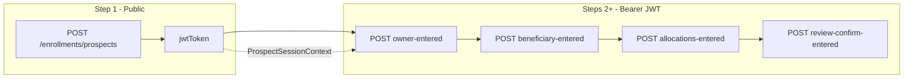

# Enrollment automation — team guide

> **Canonical source:** `api-test-automation/mobile/enrollment/ENROLLMENT-AUTOMATION-GUIDE.md` — keep in sync when updating this KB copy.

**Audience:** QA engineers adding or running MSC enrollment wizard API tests.  
**Module:** `api-test-automation/mobile/enrollment`  
**KB copy:** `qa-automation-kb/programs/unite-msc/msc-enrollment/docs/12-automation-team-guide.md`

Use this document to onboard teammates, forward as a single reference, or feed Postman details into Cursor to scaffold new wizard steps.

---

## Table of contents

1. [What this project does](#1-what-this-project-does)
2. [Documentation map](#2-documentation-map)
3. [How to run tests](#3-how-to-run-tests)
4. [Suite strategy (one wizard, three suite files)](#4-suite-strategy-one-wizard-three-suite-files)
5. [Module layout](#5-module-layout)
6. [Wizard flow overview](#6-wizard-flow-overview)
7. [Step 1 (prospect) — full walkthrough](#7-step-1-prospect--full-walkthrough)
8. [Encryption and request shape](#8-encryption-and-request-shape)
9. [Session and JWT lifecycle](#9-session-and-jwt-lifecycle)
10. [Adding wizard steps 2+ (reuse for every new endpoint)](#10-adding-wizard-steps-2-reuse-for-every-new-endpoint)
11. [What to provide when requesting a new test](#11-what-to-provide-when-requesting-a-new-test)
12. [Using Cursor to scaffold from Postman](#12-using-cursor-to-scaffold-from-postman)
13. [Test data and JSON fixtures](#13-test-data-and-json-fixtures)
14. [Quick reference tables](#14-quick-reference-tables)
15. [Troubleshooting](#15-troubleshooting)
16. [Related KB and Postman assets](#16-related-kb-and-postman-assets)

---

## 1. What this project does

The enrollment module automates the **Unite MSC enrollment wizard** end-to-end:

```text
prospect → owner → owner-address → beneficiary → bank → allocation → review/submit → …
```

Today **Step 1 (create prospect)** is implemented. Each future endpoint becomes:

- One **test class** (`OwnerRequestTest`, `AllocationRequestTest`, …)
- One **JSON fixture** (plain template before encryption)
- One or more **POJOs** in `src/main/java/pojo/`
- A new line in the **same three TestNG suite files** (wizard order)

We do **not** create a new Maven profile or new suite XML per endpoint. Regression and integration stay as **one enrollment suite each**, with steps listed in order inside each plan block.

The API is served by the **Enrollment BFF** (`enrollment-uri` in environment properties), not the legacy mobile server.

---

## 2. Documentation map

| Document | Location | Purpose |
|----------|----------|---------|
| **This guide** | `mobile/enrollment/ENROLLMENT-AUTOMATION-GUIDE.md` | Master onboarding + prospect flow + reuse |
| Wizard checklist | `mobile/enrollment/ENROLLMENT-WIZARD-GUIDE.md` | Short checklist for adding a step |
| Prospect deep-dive | `mobile/enrollment/ENROLLMENT-PROSPECT-FLOW.md` | Step 1 only (linked from this guide) |
| Run commands | `mobile/enrollment/README.md` | Maven one-liners |
| Cursor rules | `.cursor/rules/enrollment-wizard.mdc` | AI guardrails in the repo |
| Postman & encryption | `qa-automation-kb/.../msc-enrollment/` | Collections, plain payloads, SQL |
| Endpoint catalog | `qa-automation-kb/.../docs/02-endpoint-catalog.md` | All wizard paths |
| E2E sequence | `qa-automation-kb/.../docs/03-workflow-and-sequence.md` | 13-step wizard order |

**Convention:** Operational how-to for automation lives in **this repo** under `mobile/enrollment/`. Postman payloads, SQL lookups, and encryption CLI details live in **qa-automation-kb** under `msc-enrollment/`.

---

## 3. How to run tests

### Prerequisites

1. JDK + Maven (same as rest of `api-test-automation`).
2. Host DB overlay: `mobile/enrollment/src/test/resources/config/<YOUR_HOST>.properties` (gitignored). Copy from a teammate or machine template (e.g. `LT12800.properties`).
3. VPN / network access to Stage1 or QC4 as required.

### Regression (CI / Stage1 — okdirect + newyork)

```powershell
mvn -f mobile/enrollment/pom.xml test "-Pmobile-ms-enrollment-regression,acceptance-stage1" "-Dhost.properties=LT12800.properties"
```

### Integration (QC4 — okdirect + newyork)

```powershell
mvn -f mobile/enrollment/pom.xml test "-Pmobile-ms-enrollment-integration,acceptance-qc4" "-Denvironment.properties=qc4.properties" "-Dhost.properties=qc4.properties"
```

### Localhost (all three plans — okdirect, newyork, nmdirect)

```powershell
copy mobile\enrollment\testsuites\localhost-testng.xml.example mobile\enrollment\testsuites\localhost-testng.xml
mvn -f mobile/enrollment/pom.xml test "-Pmobile-ms-enrollment-localhost,acceptance-stage1" "-Dhost.properties=LT12800.properties"
```

`localhost-testng.xml` is gitignored so you can add ad-hoc tests locally without affecting CI.

---

## 4. Suite strategy (one wizard, three suite files)

| Suite file | Maven profile | Plans | Groups | Use when |
|------------|---------------|-------|--------|----------|
| `enrollment-regression-testng.xml` | `mobile-ms-enrollment-regression` | okdirect, newyork | `regression` | Stage1 / CI regression |
| `enrollment-integration-testng.xml` | `mobile-ms-enrollment-integration` | okdirect, newyork | `integration` | QC4 integration |
| `localhost-testng.xml.example` → `localhost-testng.xml` | `mobile-ms-enrollment-localhost` | okdirect, newyork, nmdirect | both | Local multi-plan runs |

Inside each suite, **one `<test>` per plan**. Wizard test classes run **in order** within that plan:

```xml
<test name="OKD enrollment wizard regression">
    <parameter name="branding" value="okdirect"/>
    <classes>
        <class name="ProspectRequestTest"/>
        <!-- <class name="OwnerRequestTest"/>  add future steps here -->
    </classes>
</test>
```

TestNG runs classes in list order so Step 1 completes (and sets JWT) before Step 2 runs.

---

## 5. Module layout

```text
mobile/enrollment/
├── ENROLLMENT-AUTOMATION-GUIDE.md     ← this file
├── ENROLLMENT-WIZARD-GUIDE.md         ← short add-step checklist
├── ENROLLMENT-PROSPECT-FLOW.md      ← Step 1 walkthrough
├── README.md
├── pom.xml
├── testsuites/
│   ├── enrollment-regression-testng.xml
│   ├── enrollment-integration-testng.xml
│   └── localhost-testng.xml.example
├── src/main/java/
│   ├── EnrollmentHttpClient.java      # X-App-Version on every call
│   ├── ProspectSession.java           # jwtToken + metadata
│   ├── ProspectSessionContext.java    # static JWT holder for wizard
│   └── pojo/                          # shared request/response POJOs
└── src/test/java/
    ├── EnrollmentBaseTest.java        # shared @BeforeClass / @BeforeMethod
    └── ProspectRequestTest.java       # Step 1 (one *RequestTest per step)
└── src/test/resources/
    ├── json/post_enrollment_prospects.json
    └── sql/mobile.sql                 # MIN_MOBILE_VERSION query
```

**Design rules:**

- Test classes live **flat** in `src/test/java/` (no `enrollment.prospects` package).
- **Endpoint path and JSON filename** live in the step test class, not in the base.
- **Shared POJOs** live in `src/main/java/pojo/` because multiple steps reuse blocks (e.g. `OwnerPOJO`).

---

## 6. Wizard flow overview



| Step | Endpoint (under `/enrollmentapi/v1/`) | Auth | Status in automation |
|------|----------------------------------------|------|----------------------|
| 1 | `POST .../enrollments/prospects` | None | **Done** — `ProspectRequestTest` |
| 2+ | `POST .../enrollments/events/owner-entered` etc. | Bearer prospect JWT | Add per [§10](#10-adding-wizard-steps-2-reuse-for-every-new-endpoint) |

Full catalog: KB `docs/02-endpoint-catalog.md`.

---

## 7. Step 1 (prospect) — full walkthrough

### What we are testing

A **new prospect** signs up. The BFF returns a **JWT** used for all later wizard POSTs.

| Item | Value |
|------|--------|
| Method + path | `POST /enrollmentapi/v1/enrollments/prospects` |
| Base URL | `enrollment-uri` (e.g. `https://unite-bff-cloud.stage1.unite529.com`) |
| Auth | **None** on this step |
| Required header | `X-App-Version` from DB `MIN_MOBILE_VERSION` |
| Body | Encrypted JSON in a **one-element array** `[{...}]` |
| Success | HTTP **200** + non-blank **`jwtToken`** |

---

### Step 0 — You start the run

You run Maven with profiles (see [§3](#3-how-to-run-tests)).

1. Maven compiles `mobile/enrollment` and dependencies (`jsonapi-core`, `jsonapi-encryption`, etc.).
2. Profile **`mobile-ms-enrollment-regression`** (or integration/localhost) picks the TestNG XML.
3. Profile **`acceptance-stage1`** or **`acceptance-qc4`** picks environment properties (`stage1.properties`, `qc4.properties` from `jsonapi-lib`).
4. **`-Dhost.properties=...`** merges your **Oracle DB** connection (gitignored overlay).
5. Build plugins unpack unite resources and merge config so the framework knows BFF URL + DB.

---

### Step 1 — TestNG reads the suite

File: `testsuites/enrollment-regression-testng.xml`

1. TestNG starts the **Enrollment Regression Suite**.
2. Only tests in group **`regression`** run.
3. Listeners attach (`JsonApiResourceManager`, HTML report listener).
4. Separate **`<test>`** blocks run **okdirect**, then **newyork** (each passes `branding` parameter).
5. Class **`ProspectRequestTest`** runs once per plan.

---

### Step 2 — Framework setup (`@BeforeClass`, once per plan)

Inheritance: `ProspectRequestTest` → `EnrollmentBaseTest` → `BaseRequestTest` → framework.

| Order | Method | What it does |
|-------|--------|----------------|
| 2a | `setupEnvironmentBeforeAll` | Sets `project = unite` from properties |
| 2b | `setupBrandingBeforeAll(branding)` | Loads plan-specific DB codes; `getBranding()` → `okdirect` / `newyork` |
| 2c | `setupBeforeAll` | Date format; `loadSqlFile("mobile.sql")`; `configureMobileEncryption(enrollment-uri, ENROLLMENT)` |

`configureMobileEncryption` stores the BFF URL and stream **`ENROLLMENT`** so `createMobilePayload()` can fetch the RSA certificate from the same host the app uses.

---

### Step 3 — Before each test (`@BeforeMethod`)

`EnrollmentBaseTest.setupBeforeEach()`:

1. **`getDatabaseConnection()`** — Oracle using merged properties.
2. **SQL** `get.mobile.min.version` — reads active `MIN_MOBILE_VERSION` from `tu_codes`.
3. **Fail** if no row (`assertFalse(versions.isEmpty(), ...)`).
4. **`new EnrollmentHttpClient(enrollment-uri)`** — HTTP client for the BFF.
5. **`setAppVersion(version)`** — version string for `X-App-Version`.
6. **`setRelaxedSSL(true)`** — Stage1 / lab certificates.
7. Assign to **`client`** for the test method.

`EnrollmentHttpClient` **fails fast** if `setAppVersion` was never called when a request is made.

---

### Step 4 — Test method starts

`postProspects_returnsJwt()` — wizard Step 1, no Bearer token.

---

### Step 5 — Load JSON fixture

```java
ProspectRequestPOJO request = loadJsonFile("post_enrollment_prospects.json", ProspectRequestPOJO.class);
```

1. Reads `src/test/resources/json/post_enrollment_prospects.json`.
2. **`generator.generateRandomData`** replaces tags:

| Tag in JSON | Becomes |
|-------------|---------|
| `$$random_number_9$$` | Random 9-digit number in username |
| `$$random_number_6$$` | Random 6-digit number in email |
| `$$random_name_first$$` / `$$random_name_last$$` | Random owner names |
| `$$branding$$` | Plan from framework (overridden again in next step) |

3. Maps to **`ProspectRequestPOJO`** with nested **`prospect`** and **`owner`** objects.

Data is still **plaintext** in memory.

---

### Step 6 — Apply branding

```java
applyBranding(request);
```

1. **`request.setPlanId(getBranding())`** — top-level plan id sent to API.
2. **`request.getProspect().setPlan(getBranding())`** — plan inside prospect block must match.
3. **`request.setUsername(request.getProspect().getUsername())`** — copies to hidden field for hashing only (`@JsonIgnore`; not in JSON wire format).

---

### Step 7 — Encrypt and build body

```java
toEncryptedArrayPayload(request);  // "[" + request.createMobilePayload() + "]"
```

Inside **`BaseMobilePOJO.createMobilePayload()`**:

1. Generate random **AES key** for this request.
2. **`prepareMobileEncryption(enrollment-uri, ENROLLMENT, aesKey)`** — GET certificate from BFF; RSA-wrap AES key → **`encAesKey`**.
3. **`usernameHash`** = SHA-512 of plain username.
4. Encrypt every field with **`@MobileEncrypt`** (username, password, email, owner names, …).
5. Serialize POJO to JSON string.
6. Wrap in **`[...]`** — enrollment BFF expects a **single-element JSON array**.

Example wire shape (values abbreviated):

```json
[{"planId":"okdirect","usernameHash":"...","encAesKey":"...","prospect":{"username":"...","password":"...","plan":"okdirect","email":"..."},"owner":{"firstName":"...","lastName":"..."}}]
```

---

### Step 8 — HTTP POST

```java
client.invokeRestApi(RestType.POST, PROSPECTS_PATH, null, body, BodyType.JSON, null);
```

1. URL = **`enrollment-uri` + `/enrollmentapi/v1/enrollments/prospects`**.
2. Headers: **`X-App-Version`**, **`Content-Type: application/json`**.
3. **No `Authorization`** on Step 1.
4. Body = encrypted array from Step 7.

---

### Step 9 — Server (BFF)

1. Validates **`X-App-Version`**.
2. Decrypts **`encAesKey`** and `@MobileEncrypt` fields.
3. Validates prospect rules for the plan.
4. Returns **200** and JSON array with **`jwtToken`** (and optional **`errors`**).

---

### Step 10 — Assertions

1. `assertEquals(status, 200)`.
2. Parse body as `List<ProspectSession>`, take index `0`.
3. `jwtToken` not null and not blank.

---

### Step 11 — Save session for Steps 2+

```java
session.setPlanId(getBranding());
session.setUsername(request.getProspect().getUsername());
ProspectSessionContext.set(session);
```

**`ProspectSessionContext`** is static in-memory storage for the current plan’s wizard run. Next steps call `ProspectSessionContext.getJwtToken()`.

When the **next plan** starts (e.g. newyork), context is **overwritten** with that plan’s new prospect.

---

### Step 12 — Cleanup and next plan

1. `@AfterMethod` releases DB connection.
2. TestNG runs the next `<test>` block (next plan).
3. All plans pass → **BUILD SUCCESS**.

---

### One-line cheat sheet (Step 1)

| # | What happens |
|---|----------------|
| 0 | Maven + profiles → suite, environment, host DB |
| 1 | TestNG → regression/integration group, per-plan branding |
| 2 | Framework → unite project, plan properties, SQL + encryption config |
| 3 | DB → `MIN_MOBILE_VERSION` → `EnrollmentHttpClient` |
| 4 | Load JSON → random username, email, names |
| 5 | Set `planId`, `prospect.plan`, hidden `username` |
| 6 | Fetch cert, encrypt fields, wrap `[{...}]` |
| 7 | POST prospects with `X-App-Version`, no Bearer |
| 8 | BFF returns 200 + JWT |
| 9 | Assert + save JWT in `ProspectSessionContext` |
| 10 | Repeat for next plan |

---

## 8. Encryption and request shape

| Concept | Plain English |
|---------|----------------|
| **`MOBILE_TYPE.ENROLLMENT`** | Tells encryption layer which cert/stream to use (not mobile1/mobile2). |
| **`@MobileEncrypt`** | Field is AES-encrypted in the outgoing JSON (like the real app). |
| **`encAesKey`** | RSA-encrypted AES key in the body so the server can decrypt. |
| **`usernameHash`** | SHA-512 of username; plain username is never sent. |
| **`[{...}]` array** | Enrollment BFF contract for encrypted POST bodies. |
| **Certificate fetch** | Done automatically from `enrollment-uri` during `createMobilePayload()`. |

Manual encryption for Postman: KB `docs/04-encryption-guide.md` and `jsonapi-encryption` CLI.

---

## 9. Session and JWT lifecycle

```text
ProspectRequestTest
    POST prospects (no Bearer)
    → ProspectSession { jwtToken, planId, username }
    → ProspectSessionContext.set(session)

OwnerRequestTest (future)
    client.addHeader("Authorization", "Bearer " + ProspectSessionContext.getJwtToken())
    POST owner-entered (encrypted body)
    → assert 200 / empty errors

… same JWT for all wizard POSTs until review-confirm …
```

Rules:

- **One prospect JWT per plan per suite run** — do not create a new prospect in Step 2+.
- **Do not** use member JWT from review-confirm for the initial wizard (that is a different phase).
- Each **`<test branding=...>`** block is an isolated wizard chain.

---

## 10. Adding wizard steps 2+ (reuse for every new endpoint)

Use the **same pattern** for owner, beneficiary, bank, allocation, submit, and any future endpoint.

### Do

| # | Action |
|---|--------|
| 1 | Add plain JSON under `src/test/resources/json/<name>.json` |
| 2 | Add/reuse POJOs in `src/main/java/pojo/` (`BaseMobilePOJO`, `@MobileEncrypt`) |
| 3 | Create `<Step>RequestTest.java` extending `EnrollmentBaseTest` |
| 4 | Put **path + JSON filename** as `private static final` in that class |
| 5 | `@Test(groups = {"integration", "regression"})` |
| 6 | Before POST: `client.addHeader("Authorization", "Bearer " + ProspectSessionContext.getJwtToken())` |
| 7 | Body: `loadJsonFile` → branding tweaks → `toEncryptedArrayPayload(request)` |
| 8 | Assert HTTP status + scenario-specific fields (prefer `assertThat` for POJOs) |
| 9 | Append class name **below** prior steps in **all three** suite XML files |

### Do not

- Create new TestNG suite XML files per endpoint.
- Create new Maven profiles per endpoint.
- Put endpoint paths in `EnrollmentBaseTest`.
- Call create-prospect again in Step 2+.
- Use `SkipException` to hide failures.

### Example skeleton (Step 2)

```java
public class OwnerRequestTest extends EnrollmentBaseTest {

    private static final String OWNER_ENTERED_PATH =
            "/enrollmentapi/v1/enrollments/events/owner-entered";
    private static final String POST_OWNER_JSON = "post_enrollment_owner_entered.json";

    @Test(groups = {"integration", "regression"},
            description = "POST owner-entered after prospect JWT")
    public void postOwnerEntered_success() throws Exception {
        client.addHeader("Authorization", "Bearer " + ProspectSessionContext.getJwtToken());

        OwnerEnteredRequestPOJO request = loadJsonFile(POST_OWNER_JSON, OwnerEnteredRequestPOJO.class);
        // apply plan-specific fields from getBranding() / ProspectSessionContext.get() as needed

        HttpRestApiClientResponse response = client.invokeRestApi(
                RestType.POST, OWNER_ENTERED_PATH, null,
                toEncryptedArrayPayload(request), BodyType.JSON, null);

        assertEquals(response.getStatusCode(), HTTP_STATUS_CODES.OK.code);
        // add response assertions per KB validation strategy
    }
}
```

Short checklist: [ENROLLMENT-WIZARD-GUIDE.md](ENROLLMENT-WIZARD-GUIDE.md).

---

## 11. What to provide when requesting a new test

Give these to whoever implements the test (or paste into Cursor with the enrollment rule enabled).

### Required

| # | Provide | Example |
|---|---------|---------|
| 1 | **Postman request** (or KB plain JSON path) | `msc-enrollment/postman/payloads/plain/06-owner-entered.json` |
| 2 | **HTTP method + full path** | `POST /enrollmentapi/v1/enrollments/events/owner-entered` |
| 3 | **Wizard order** | After prospect, before beneficiary |
| 4 | **Auth** | Bearer prospect JWT (yes for step 2+) |
| 5 | **Which fields are encrypted** | Match `@MobileEncrypt` in Postman/plain doc |
| 6 | **Expected success** | HTTP 200, empty `errors`, specific fields |
| 7 | **Branding-specific quirks** | e.g. field only for newyork |
| 8 | **Sample success response** | From Postman or KB |

### Optional but helpful

- Negative scenarios (validation errors) and expected error message/code.
- SQL for **post-wizard** DB check only (not mid-flow — see KB validation strategy).
- Link to legacy Cucumber scenario if porting.

### Where assets live

| Asset | Repository path |
|-------|-----------------|
| Postman collection | `qa-automation-kb/.../msc-enrollment/postman/` |
| Plain payloads | `qa-automation-kb/.../postman/payloads/plain/` |
| Per-endpoint SQL (reference) | `qa-automation-kb/.../msc-enrollment/sql/` |
| Automation code | `api-test-automation/mobile/enrollment/` |

---

## 12. Using Cursor to scaffold from Postman

1. Open **`api-test-automation`** in Cursor.
2. Ensure rule **`.cursor/rules/enrollment-wizard.mdc`** applies (edits under `mobile/enrollment/`).
3. Prompt template:

```text
Add enrollment wizard step for [owner-entered].
Read mobile/enrollment/ENROLLMENT-AUTOMATION-GUIDE.md and ENROLLMENT-WIZARD-GUIDE.md.

Postman plain JSON: qa-automation-kb/.../postman/payloads/plain/06-owner-entered.json
Endpoint: POST /enrollmentapi/v1/enrollments/events/owner-entered
Runs after ProspectRequestTest in all three suite XML files.
Reuse OwnerPOJO where the body matches.
```

4. Review generated POJOs, test class, JSON fixture, and suite XML ordering.
5. Run localhost suite for okdirect + newyork + nmdirect before opening MR.

Cursor should **not** invent new suite files or Maven profiles.

---

## 13. Test data and JSON fixtures

### Current prospect fixture

File: `src/test/resources/json/post_enrollment_prospects.json`

| Field | Source |
|-------|--------|
| Username | `QAAUTOTEST_MSC_$$random_number_9$$` |
| Password | `Newton@123` (fixed) |
| Email | `Initial$$random_number_6$$@ascensus.com` |
| Plan | `getBranding()` at runtime |
| Owner names | Random from generator tags |

### Standards (KB)

- Unique username/email/SSN per run — see `msc-enrollment/docs/06-test-data-standards.md`.
- Prefix pattern: `QAAUTOTEST_MSC_` for MSC enrollment automation.

### SQL in this module

`src/test/resources/sql/mobile.sql` — only **`MIN_MOBILE_VERSION`** for the app version header. Per-endpoint SQL for dynamic IDs (funds, routing, etc.) stays in **KB** until a step needs it in automation.

---

## 14. Quick reference tables

### Maven profiles

| Profile | Suite |
|---------|--------|
| `mobile-ms-enrollment-regression` | `enrollment-regression-testng.xml` |
| `mobile-ms-enrollment-integration` | `enrollment-integration-testng.xml` |
| `mobile-ms-enrollment-localhost` | `localhost-testng.xml` |
| `acceptance-stage1` | `stage1.properties` |
| `acceptance-qc4` | `qc4.properties` |

### Key Java types

| Class | Role |
|-------|------|
| `EnrollmentBaseTest` | DB version, client, `toEncryptedArrayPayload()` |
| `EnrollmentHttpClient` | Sends `X-App-Version`; fails if unset |
| `ProspectRequestTest` | Step 1 — path + JSON in class |
| `ProspectSession` | Response POJO (`jwtToken`, errors) |
| `ProspectSessionContext` | Shared JWT for wizard |
| `ProspectRequestPOJO` | Encrypted create-prospect body |

### Headers by step

| Step | `X-App-Version` | `Authorization` |
|------|-------------------|-------------------|
| 1 Prospects | Yes (from DB) | No |
| 2+ Wizard POSTs | Yes | `Bearer <prospect JWT>` |

---

## 15. Troubleshooting

| Symptom | Likely cause | Check |
|---------|--------------|-------|
| `MIN_MOBILE_VERSION not found` | DB code missing | `tu_codes` type `MIN_MOBILE_VERSION` active |
| `X-App-Version not initialized` | Client used without `setAppVersion` | `EnrollmentBaseTest.setupBeforeEach` |
| HTTP 426 / version errors | Wrong app version | DB version vs BFF expectation |
| HTTP 500 on encrypt | Wrong BFF URL or cert | `enrollment-uri`, `MOBILE_TYPE.ENROLLMENT` |
| HTTP 401 on Step 2+ | Missing/expired JWT | `ProspectSessionContext`; class order in suite XML |
| Wrong plan | Branding not applied | `applyBranding()` pattern; suite `branding` param |
| QC4 prospect failures | Environment-specific | Prefer Stage1 for enrollment; see KB README |

---

## 16. Related KB and Postman assets

| Topic | KB path |
|-------|---------|
| MSC enrollment hub | `qa-automation-kb/programs/unite-msc/msc-enrollment/README.md` |
| Endpoint list | `msc-enrollment/docs/02-endpoint-catalog.md` |
| 13-step sequence | `msc-enrollment/docs/03-workflow-and-sequence.md` |
| Encryption | `msc-enrollment/docs/04-encryption-guide.md` |
| Validation rules | `msc-enrollment/docs/05-validation-strategy.md` |
| Postman how-to | `msc-enrollment/docs/10-postman-usage-guide.md` |
| Plain payloads | `msc-enrollment/postman/payloads/plain/` |

---

*Last updated with enrollment wizard refactor (single regression/integration suite, `ProspectRequestTest`, `ProspectSessionContext`).*
